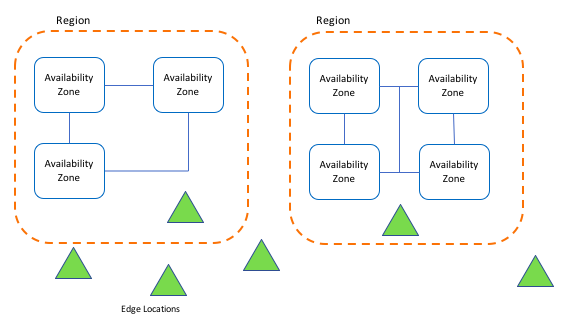
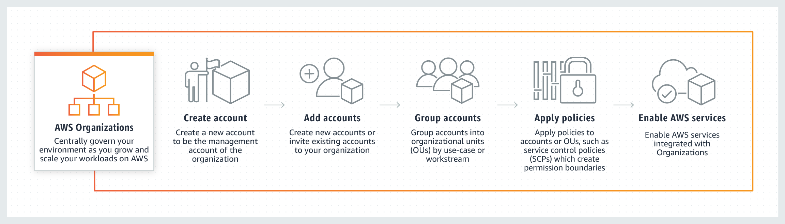
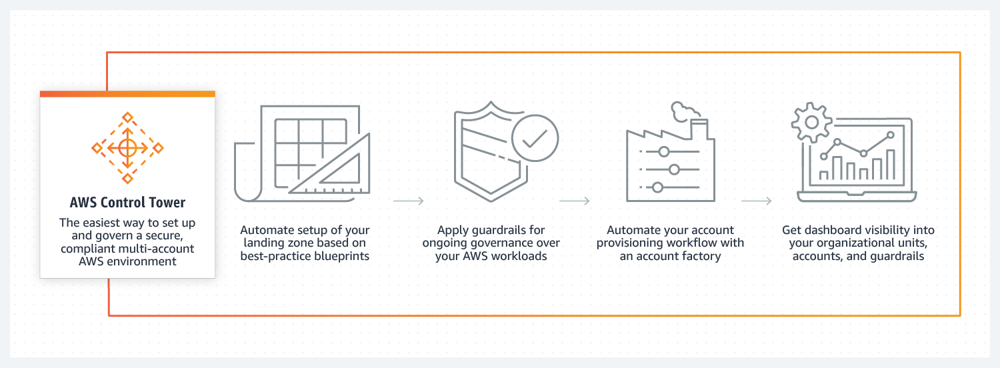
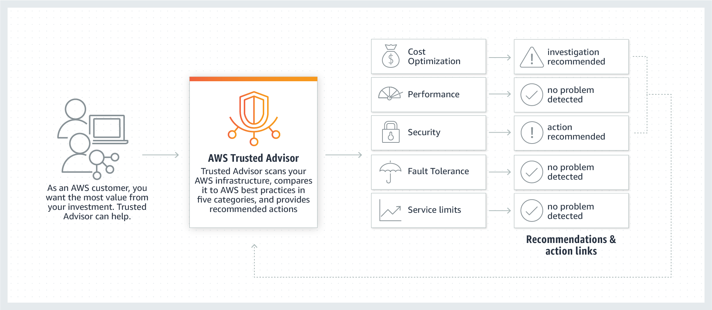
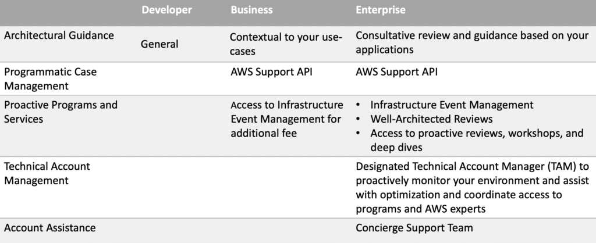

# Este espaço tem como missão usar as 7 melhores formas de aplicar a aprendizagem <i>ATIVA</i> nos estudos AWS Cloud Practitioner Certification. 
1. Anote tudo!
2. Grife e rabisque!
3. Questione-se ao final de uma leitura ou aula
4. Pesquise mais!
5. Faça exercícios
6. Crie mapas mentais
7. Ensine alguém!

# Objetivo
Alem do objetivo acima o memso tem como organizar em um so topicos varios possibilidades de estudos, para o estudo
da AWS Cloud Practitioner Certification, focando em outros que já relatarm como chegar lá, e também ligar conteúdos que 
foram e poderão ser de grande ajuda, para novos estudantes.

# AWS Cloud Practitioner Exam Guide

O exame AWS Certified Cloud Practitioner (CLF-C01) tem como objetivo para indivíduos que têm o conhecimento e as habilidades necessárias para efetivamente demonstrar uma compreensão geral da nuvem AWS, independente de funções técnicas específicas abordadas por outras certificações AWS (por exemplo,Arquiteto de soluções - Associado, Desenvolvedor - Associado ou SysOps Administrador - Associado). 
Este exame permite que os indivíduos validem seus conhecimento da nuvem AWS com uma credencial reconhecida pelo setor.

Este guia está em construção sua função e auxiliar a todos que desejam tirar a certificação AWS Certified Cloud Practitioner, o tematica e compartilhar alguns de meus pensamentos e ideias para aqueles que planejam fazer o exame.
A certificação do AWS Cloud Practitioner é um ótimo ponto de entrada no mundo do Amazon AWS.

Nosso foco e a AWS Cloud Practitioner Certification, que e a porta de entrada para as demais. 

# O que é AWS Cloud Practitioner Certification?

 O que é AWS Cloud Practitioner Certification? 

A Amazon tem vários caminhos de certificação de nuvem AWS. 
A certificação AWS Certified Cloud Practitioner é uma certificação de nível básico que se destina a demonstrar um nível básico de conhecimento e habilidades da nuvem Amazon AWS. 
Este exame é adequado para profissionais em funções técnicas, gerenciais e de vendas.

Para obter a certificação, você deve passar em um único exame. A Amazon recomenda que você tenha pelo menos <b>6 meses de experiência</b> antes de fazer o exame. Não tinha experiência anterior com o Amazon AWS antes de estudar para o exame. Eu, no entanto busco de todas as formas evoluir.

A página de certificação Certified Cloud Practitioner fornece links para vários recursos de estudo, incluindo white papers da AWS, links para reservar o exame, exemplos de perguntas de teste etc.

# O conteúdo abordado no exame é o seguinte:

Domain 1 --> Cloud Concepts      --> <b>26%</b>  
Domain 2 --> Security            --> <b>25%</b>  
Domain 3 --> Technology          --> <b>33%</b>  
Domain 4 --> Billing and Pricing --> <b>16%</b>  

# Domain 1: Cloud Concepts
1.1 Define the AWS Cloud and its value proposition  
1.2 Identify aspects of AWS Cloud economics  
1.3 List the different cloud architecture design principles  

# Domain 2: Security
2.1 Define the AWS Shared Responsibility model  
2.2 Define AWS Cloud security and compliance concepts  
2.3 Identify AWS access management capabilities  
2.4 Identify resources for security support  

# Domain 3: Technology
3.1 Define methods of deploying and operating in the AWS Cloud  
3.2 Define the AWS global infrastructure  
3.2 Identify the core AWS services  
3.4 Identify resources for technology support  

# Domain 4: Billing and Pricing
4.1 Compare and contrast the various pricing models for AWS  
4.2 Recognise the various account structures in relation to AWS billing and pricing  
4.3 Identify resources available for billing support  

O exame AWS Certified Cloud Practitioner (CLF-C01) tem como objetivo para indivíduos que têm o conhecimento e as habilidades necessárias para efetivamente
demonstrar uma compreensão geral da nuvem AWS, independente de funções técnicas específicas abordadas por outras certificações AWS (por exemplo, Arquiteto de soluções - Associado, Desenvolvedor - Associado ou SysOps Administrador - Associado). 
Este exame permite que os indivíduos validem seus conhecimento da nuvem AWS com uma credencial reconhecida pelo setor.

# Detalhes do exame
Preços: US$ 100

Duração do exame: 90 minutos

Conteúdo do exame:
Dois tipos de perguntas no exame
Múltipla escolha: tem uma resposta correta e três respostas incorretas (distratores).
Resposta múltipla: tem duas respostas corretas de cinco opções.

Escolha sempre a (s) melhor (es) resposta (s). Respostas incorretas
serão plausíveis e são projetados para serem atraentes para candidatos que não sabem a resposta correta.

As perguntas não respondidas são pontuadas como incorretas. Há sem penalidade por adivinhação.

Resultados dos exames:
O exame AWS Certified Cloud Practitioner (CLF-C01) é uma aprovação ou falha no exame. O exame é pontuado em relação a um padrão mínimo
estabelecido por profissionais da AWS que são orientados pela indústria de certificação melhores práticas e diretrizes.
Os resultados do exame são relatados como uma pontuação em escala de 100 a 1000, com uma pontuação mínima para aprovação de 700. 
A pontuação mostra como você executou no exame como um todo e se você ou não passado.
Validade do exame: 2 anos; A recertificação é necessária a cada 2 anos para todos Certificações da AWS.

# Guia de preparação para exames
A preparação para o exame pode ser realizada por meio do auto-estudo com livros didáticos, exames práticos e programas de sala de aula no local. Este livro fornece você com todas as informações e conhecimento para ajudá-lo a passar no AWS Exame Certified Cloud Practitioner. 
IPSpecialist fornece suporte completo para o candidatos para que passem no exame.

<b>Etapa 1:</b> Faça o AWS Training Class
Esses cursos e materiais de treinamento ajudarão na preparação para o exame:
AWS Training <a href="https://aws.amazon.com/pt/training/">(aws.amazon.com/training)</a>

E no link acima obter os materiais de estudo 
<a href="https://d1.awsstatic.com/training-and-certification/ramp-up_guides/Ramp-Up_Guide_CloudPractitioner.pdf"> Pdf com as informações</a> 

O Arquivo acima possuem informações importantes pois LEARNING RESOURCE,  DURATION e o TYPE, o que te fornece um caminho para seguir, o que a frente será destacado cada tema e como cada questão e formada. 

<b>Etapa 2:</b> analise o guia do exame e exemplos de perguntas
Revise o modelo do exame e estude os exemplos de perguntas disponíveis em Site da AWS

<b>Etapa 3:</b> prática com laboratórios individualizados e oficial de estudo Documentações

Registre-se em contas de nível gratuito da AWS para usar serviços gratuitos limitados e
Laboratórios de prática. Além disso, você pode estudar a documentação oficial sobre o local na rede Internet.

<b>Etapa 4:</b> estudar os whitepapers da AWS
1. Amplie seu conhecimento técnico com white papers escritos pela AWS equipe.
2. AWS Whitepapers (aws.amazon.com/whitepapers) Kindle, .pdf e outros Materiais
3. Visão geral do white paper Amazon Web Services, abril de 2017
4. Architecting for the Cloud: whitepaper de práticas recomendadas da AWS, fevereiro de 2016
5. White paper How AWS Pricing Works, março de 2016
6. O custo total de (não) propriedade de aplicativos da Web na nuvem white paper, agosto de 2012
7. Página de comparação dos planos de suporte da AWS

<b>Etapa 5:</b> Revise as perguntas frequentes da AWS
Navegue por essas perguntas frequentes para encontrar respostas às perguntas mais comuns.

<b>Etapa 6:</b> faça um exame simulado
Teste seus conhecimentos online em um ambiente cronometrado, registrando-se em aws.training.

<b>Etapa 7:</b> agende seu exame e obtenha a certificação
Agende seu exame em um centro de testes perto de você em aws.training.

# Os serviços AWS

Os serviços AWS permitem o acesso a recursos de computação, armazenamento, banco de dados e diversos outros serviços de TI do tipo on demand (sob demanda). Segundo a Amazon, essa forma de computação reduz custos, minimiza os riscos de falhas e maximiza as oportunidades de negócio

O portal da AWS para o Brasil é <a href="https://aws.amazon.com/pt/" alt="PT" > (https://aws.amazon.com/pt/) </a>. 

É possível experimentar os principais serviços, de maneira totalmente gratuita, durante o período de um ano. Mais informações sobre essa experimentação gratuita são encontradas nesta página: <a href="https://aws.amazon.com/pt/free/" alt="https://aws.amazon.com/pt/free/"> https://aws.amazon.com/pt/free/ </a>.

A Nuvem AWS está presente em 190 países, por meio de 13 regiões geográficas, 35 zonas de disponibilidade e mais de 50 pontos de presença locais. A Figura 05 apresenta essa abrangência global, sendo possível observar onde estão localizados os Data Centers da Amazon.

Figura XX - Abrangência e pontos de presença locais da Nuvem AWS.  

Fonte: Site da Amazon. Disponível em: <https://aws.amazon.com/pt/what-is-aws>. Acesso em: Ago. de 2021.

São clientes da AWS empresas como Netflix, Dropbox, Airbnb e Spotify. Todas elas se transformaram em gigantes da computação usando os serviços providos pelos Data Centers da Amazon.

A AWS possui um conjunto bastante vasto de produtos e serviços de diversas categorias (processamento, rede, desenvolvimento, banco de dados, etc.), conforme podemos observar na Figura Abaixo.

Figura XX - Produtos e serviços da Amazon Web Services.  

Fonte: Serviços da Amazon. Disponível em: <http://images.slideplayer.com/26/8773584/slides/slide_2.jpg>. Acesso em: Ago. de 2021.

# Em um artigo da Computer World destaca os 30 serviços mais procurados na AWS

Fonte: Serviços da Amazon. Disponível em: <https://www.computerworld.com.pt/2016/06/17/30-servicos-mais-procurados-na-aws/>. Acesso em: Ago. de 2021.

# Algumas tecnicas que ajuda na melhoria do Aprendizagem:

Segundo <b>Beatriz Oliveira</b> em seu artigo de titulo: 

# Como me preparei para a certificação AWS Certified Cloud Practitioner
Disponível em: <a href="https://medium.com/sysadminas/como-me-preparei-para-a-certifica%C3%A7%C3%A3o-aws-cloud-pratictioner-358d37fb9c60" alt="Artigo Beatriz Oliveira"> (https://medium.com/sysadminas/como-me-preparei-para-a-certifica%C3%A7%C3%A3o-aws-cloud-pratictioner-358d37fb9c60) </a>

Neste artigos ela relata dicas para quem quer tirar essa certificação, que neste momento estou seguindo:

Se você já tem certa experiência com AWS, dedique pelo menos 1 hora por dia, durante uns 3 meses para estudar, acredito que esse é um período bacana para estudar tranquilamente para a prova. A Amazon recomenda essa certificação para quem tem pelo menos 6 meses de experiência, então acredito que seguir essa recomendação para se preparar é bem interessante.

Siga o guia de preparação disponível no site da AWS. 
<a href="https://d1.awsstatic.com/training-and-certification/docs-cloud-practitioner/AWS-Certified-Cloud-Practitioner_Exam-Guide.pdf"> Guia de Preparação </a>

Faça simulados gratuitos, como o que está disponível no site da whizlabs. 
<a href="https://www.whizlabs.com/aws-certified-cloud-practitioner/">https://www.whizlabs.com/aws-certified-cloud-practitioner/</a>

Se puder, faça o exame prático disponível no site da AWS 
<a href="https://aws.amazon.com/pt/certification/certification-prep/"> https://aws.amazon.com/pt/certification/certification-prep/ </a>.

Crie uma conta no site do AWS para se familiarizar com a interface e com os serviços durante o estudo.

# Outros meios que estou utilizando tambem:
1. Criação de Mapas Mentais.   
2. Livros especificos (Assunto) e Questões.   
3. Criação de um banco de dados de questões sobre a Certificação especifica.  
4. Aprendizagem baseada em projetos  
5. Aprendizagem baseada em problemas  
6. Busca aulas no youtube sobre o assunto.  

# 1. Criação de Mapas Mentais.

The mindmaps for AWS services to get AWS Certificates easier. For Vietnamese, you can see the study guide [here](http://notcuder.com/toi-da-lay-chung-chi-aws-solutions-architect-associate-nhu-the-nao/)

Those images is designed with [xmind tool](http://www.xmind.net)

# 2. Livros especificos (Assunto) e Questões.

    
    
    
    
    
    

# 3. Criação de um banco de dados de questões sobre a Certificação especifica. 

<a href="https://www.awslagi.com/practice-questions/"  alt="practice-questions">practice-questions</a> 
Acesso em: Ago. de 2021. 
O mesmo tem varias questões pra treino, no caso de AWS Cloud Practitioner, o site possue 3 Quiz e mais 6 Pdfs, com as questões.

# 6. Busca aulas no youtube sobre o assunto.

Canais no youtube Sobre o Assunto:
  
1. Projeto Cabeça na Nuvem 
www.cabecananuvem.com 
Introdução à conceitos de computação na nuvem e conteúdo para certificação AWS Cloud Practitioner. 
Cristiano Pelizzari 
linkedin: <a href="https://www.linkedin.com/company/cabe%C3%A7a-na-nuvem/" alt="">https://www.linkedin.com/company/cabe%C3%A7a-na-nuvem/</a>

<a href="https://www.youtube.com/watch?v=68pF-rrJyqQ&list=PLMpVQWIR2lKesl8rRdVg4qbQcP64xGI2z" alt=""> PlayList com 86 videos:</a>
 
Acesso em: Ago. de 2021. 

O que faz desta playlist completa e a questão de mostar na pratica o uso da AWS, além de ter uma parte teorica bem especifica
e direcionada, outra vantagem e que o mesmo e em português. 

2. Freecodecamp 
<a href="https://www.youtube.com/watch?v=3hLmDS179YE&t=896s" alt=""> AWS Certified Cloud Practitioner Training 2020 - Full Course</a>
 
Acesso em: Ago. de 2021.  

Descrição do video: 
Este curso o ajudará a se tornar um AWS Certified Cloud Practitioner. Você obterá um entendimento completo da plataforma AWS Cloud e estará preparado para fazer o exame de certificação. 
Este conhecimento e certificação abrirão oportunidades de trabalho. Você poderá provar sua experiência em AWS e computação em nuvem. 
O exame pode ser feito em qualquer lugar como um exame supervisionado online. 
Outro detalhe legal deste video e que os comentarios, onde muitos dão creditos a aprovação por ter estudado com este formato. 

3. IT & Software

<a href="https://www.youtube.com/watch?v=h5jaLL0jHSQ&t=3939s" alt=""> AWS Certified Cloud Practitioner Training Bootcamp</a>
 
Acesso em: Ago. de 2021.  

AWS Certified Cloud Practitioner Training Bootcamp
Latest Exam Version - PREPARE and PASS the AWS Certified Cloud Practitioner (CLF-C01) Exam

# Calculator

https://calculator.aws/#/

# Labs 
https://amazon.qwiklabs.com/

# Algumas dos caminhos já percorridos
https://blogs.sap.com/2021/05/24/get-certified-aws-certified-cloud-practitioner-clf-c01/

# Domain 1: Cloud Concepts
1.1 Define the AWS Cloud and its value proposition  
1.2 Identify aspects of AWS Cloud economics  
1.3 List the different cloud architecture design principles  

# Why is cloud computing so popular?
Depending on who you ask, some estimates peg the global cloud computing market at around USD 370 billion in 2020, growing to about USD 830 billion by 2025. 
This implies a Compound Annual Growth Rate (CAGR) of around 18% for the period. 
There are multiple reasons why the cloud market is growing so fast. Some of them are
- listed here:
    - Elasticity
    - Security
    - Availability
    - Faster hardware cycles
    - System administration staff
    - Faster time to market

# The Six pillars of a well-architected framework
<a href="https://aws.amazon.com/blogs/apn/the-6-pillars-of-the-aws-well-architected-framework/" alt=""> 
    The Six pillars of a well-architected framework</a>
 
Acesso em: Junho de 2022. 

Creating a software system is a lot like constructing a building. If the foundation is not solid, structural problems can undermine the integrity and function of the building.

When building technology solutions on Amazon Web Services (AWS), if you neglect the six pillars of operational excellence, security, reliability, performance efficiency, cost optimization, and sustainability, it can become challenging to build a system that delivers on your expectations and requirements.

Incorporating these pillars into your architecture helps produce stable and efficient systems. This allows you to focus on the other aspects of design, such as functional requirements.

The AWS Well-Architected Framework helps cloud architects build the most secure, high-performing, resilient, and efficient infrastructure possible for their applications. The framework provides a consistent approach for customers and AWS Partners to evaluate architectures, and provides guidance to implement designs that scale with your application needs over time.

In this post, we provide an overview of the Well-Architected Framework’s six pillars and explore design principles and best practices. You can find more details—including definitions, FAQs, and resources—in each pillar’s whitepaper we link to below.

: 
https://docs.aws.amazon.com/wellarchitected/latest/framework/welcome.html

# 1. Operational Excellence
The Operational Excellence pillar includes the ability to support development and run workloads effectively, gain insight into their operation, and continuously improve supporting processes and procedures to delivery business value. You can find prescriptive guidance on implementation in the Operational Excellence Pillar whitepaper.

## Design Principles
There are five design principles for operational excellence in the cloud:
- Perform operations as code
- Make frequent, small, reversible changes
- Refine operations procedures frequently
- Anticipate failure
- Learn from all operational failures

## Best Practices
Operations teams need to understand their business and customer needs so they can support business outcomes. Ops creates and uses procedures to respond to operational events, and validates their effectiveness to support business needs. Ops also collects metrics that are used to measure the achievement of desired business outcomes.

Everything continues to change—your business context, business priorities, and customer needs. It’s important to design operations to support evolution over time in response to change, and to incorporate lessons learned through their performance.

# 2. Security
The Security pillar includes the ability to protect data, systems, and assets to take advantage of cloud technologies to improve your security. You can find prescriptive guidance on implementation in the Security Pillar whitepaper.

## Design Principles
There are seven design principles for security in the cloud:
- Implement a strong identity foundation
- Enable traceability
- Apply security at all layers
- Automate security best practices
- Protect data in transit and at rest
- Keep people away from data
- Prepare for security events

## Best Practices
Before you architect any workload, you need to put in place practices that influence security. You’ll want to control who can do what. In addition, you want to be able to identify security incidents, protect your systems and services, and maintain the confidentiality and integrity of data through data protection.

You should have a well-defined and practiced process for responding to security incidents. These tools and techniques are important because they support objectives such as preventing financial loss or complying with regulatory obligations.

The AWS Shared Responsibility Model enables organizations that adopt the cloud to achieve their security and compliance goals. Because AWS physically secures the infrastructure that supports our cloud services, as an AWS customer you can focus on using services to accomplish your goals. The AWS Cloud also provides greater access to security data and an automated approach to responding to security events.

# 3. Reliability
The Reliability pillar encompasses the ability of a workload to perform its intended function correctly and consistently when it’s expected to. This includes the ability to operate and test the workload through its total lifecycle. You can find prescriptive guidance on implementation in the Reliability Pillar whitepaper.

## Design Principles
There are five design principles for reliability in the cloud:

Automatically recover from failure
- Test recovery procedures
- Scale horizontally to increase aggregate workload availability
- Stop guessing capacity
- Manage change in automation

## Best Practices
Before building any system, foundational requirements that influence reliability should be in place. For example, you must have sufficient network bandwidth to your data center. These requirements are sometimes neglected (because they are beyond a single project’s scope). With AWS, however, most of the foundational requirements are already incorporated or can be addressed as needed.

The cloud is designed to be nearly limitless, so it’s the responsibility of AWS to satisfy the requirement for sufficient networking and compute capacity, leaving you free to change resource size and allocations on demand.

A reliable workload starts with upfront design decisions for both software and infrastructure. Your architecture choices will impact your workload behavior across all six AWS Well-Architected pillars. For reliability, there are specific patterns you must follow, such as loosely coupled dependencies, graceful degradation, and limiting retries.

Changes to your workload or its environment must be anticipated and accommodated to achieve reliable operation of the workload. Changes include those imposed on your workload, like a spikes in demand, as well as those from within such as feature deployments and security patches.

Low-level hardware component failures are something to be dealt with every day in an on-premises data center. In the cloud, however, these are often abstracted away. Regardless of your cloud provider, there is the potential for failures to impact your workload. You must therefore take steps to implement resiliency in your workload, such as fault isolation, automated failover to healthy resources, and a disaster recovery strategy.

# 4. Performance Efficiency
The Performance Efficiency pillar includes the ability to use computing resources efficiently to meet system requirements, and to maintain that efficiency as demand changes and technologies evolve. You can find prescriptive guidance on implementation in the Performance Efficiency Pillar whitepaper.

## Design Principles
There are five design principles for performance efficiency in the cloud:
- Democratize advanced technologies
- Go global in minutes
- Use serverless architectures
- Experiment more often
- Consider mechanical sympathy

## Best Practices
Take a data-driven approach to building a high-performance architecture. Gather data on all aspects of the architecture, from the high-level design to the selection and configuration of resource types.

Reviewing your choices on a regular basis ensures you are taking advantage of the continually evolving AWS Cloud. Monitoring ensures you are aware of any deviance from expected performance. Make trade-offs in your architecture to improve performance, such as using compression or caching, or relaxing consistency requirements

The optimal solution for a particular workload varies, and solutions often combine multiple approaches. AWS Well-Architected workloads use multiple solutions and enable different features to improve performance

# 5. Cost Optimization
The Cost Optimization pillar includes the ability to run systems to deliver business value at the lowest price point. You can find prescriptive guidance on implementation in the Cost Optimization Pillar whitepaper.

## Design Principles
There are five design principles for cost optimization in the cloud:
- Implement cloud financial management
- Adopt a consumption model
- Measure overall efficiency
- Stop spending money on undifferentiated heavy lifting
- Analyze and attribute expenditure

## Best Practices
As with the other pillars, there are trade-offs to consider. For example, do you want to optimize for speed to market or for cost? In some cases, it’s best to optimize for speed—going to market quickly, shipping new features, or simply meeting a deadline—rather than investing in up-front cost optimization.

Design decisions are sometimes directed by haste rather than data, and as the temptation always exists to overcompensate rather than spend time benchmarking for the most cost-optimal deployment. This might lead to over-provisioned and under-optimized deployments.

Using the appropriate services, resources, and configurations for your workloads is key to cost savings

# Regions, Availability Zones, and Local Zones
How can Amazon provide such reliable service across the globe? How can they offer
reliability and durability guarantees for some of their services? The answer reveals why
they are the cloud leaders and why it's difficult to replicate what they offer. Amazon
has billions of dollars of infrastructure deployed across the world. These locations are
organized into different Regions and zones. More formally, Amazon calls them the
- following:
    - AWS Regions
    - AZs
    - LZs

AWS Regions exist in separate geographic areas. Each AWS Region comprises several
independent and isolated data centers that provide a full array of AWS services dubbed AZs. 
LZs can be thought of as mini-AZs that provide core services that are latency sensitive. 

You can leverage LZs to ensure that resources are in close geographic proximity to
your users.  

Amazon is continuously enhancing its data centers to provide the latest technology.  
Amazon's data centers have a high degree of redundancy. Amazon uses highly reliable
hardware, but hardware is not foolproof. Occasionally, a failure can happen that interferes
with the availability of resources in each data center.    
If all instances are hosted in only one data center, the possibility exists that a failure can occur with the whole data center
and then none of your resources will be available.  
The following diagram illustrates how Regions, AZs, and LZs are organized:   

Notice that Regions can contain both AZs as well as LZs.   
It is important to highlight that AWS Regions are independent of each other. For example, all Amazon RDS activity
and commands such as the creation of a database instance or listing which databases
are available can only run in one Region at a time. By default, there will always be a
designated default Region.    
- This default can be changed in one of two ways:
    - It can be modified via the console by changing the EC2_REGION environment variable.
    - By changing the region parameter using the AWS Command Line Interface (AWS CLI).   
You can obtain more information about how to change and maintain AWS environment variables using 
the AWS CLI by visiting this link: 
<a href="https://docs.aws.amazon.com/cli/latest/userguide/cli-configure-envvars.html">
https://docs.aws.amazon.com/cli/latest/userguide/cli-configure-envvars.html
</img> .

In the following subsections, we will look at AWS Regions in greater detail and see why they are important.  

# AWS Regions
AWS Regions are groupings of data centers in one geographic location that are specially
designed to be independent and isolated from each other. This independence promotes
availability and enhances fault tolerance and stability.    

For most services, when you log into the AWS console, you will see the services that are
available specifically for that Region. As AWS builds out their infrastructure, there may be
cases here and there where a specific service is not available in a certain Region. Usually,
this is a temporary situation as the service propagates across all Regions. This can happen
when a service is still not <b>generally available (GA)</b> and still in the Beta stage.   

A few select services are available globally and are not Region specific. Some examples are
<b>Simple Storage Service (S3)</b> and <b>Identity Management Service (IAM).</b>    

Other services allow you to create inter-Region fault tolerance and availability. For
example, Amazon RDS allows the creation of read replicas in multiple Regions. To find
out more about it, visit 
<a href="https://aws.amazon.com/blogs/aws/cross-region-read-replicas-for-amazon-rds-for-mysql/">
    https://aws.amazon.com/blogs/aws/cross-region-read-replicas-for-amazon-rds-for-mysql/
</img>

One of the advantages of using such an architecture is that resources will be closer to users
and will therefore increase access speed and reduce latency.   

Another obvious advantage is that you will be able to serve your clients without disruption
even if a whole Region becomes unavailable, and you will be able to recover faster if
something goes terribly wrong. These read replicas can be automatically converted to the
primary database if the need arises. 

As of August 2020, there are 24 AWS Regions and 3 announced Regions. The naming
convention that is usually followed is to list the country code, followed by the geographic
region, followed by a number. For example, the US East Region in Ohio is named as
follows:
    - Location: US East (Ohio)
        - Name: us-east-2

Regardless of where you live in the world, if you live in a populated area there is bound to
be an AWS Region within at most 500 miles or so from you. If you live in Greenland, it
may be a little further away from you (however, you will still be able to connect as long as
you have an internet connection). 

- In addition, AWS has two dedicated Regions just for the US government:
    - Location: AWS GovCloud (US-East)
        - Name: us-gov-east-1
    - Location: AWS GovCloud (US)
        - Name: us-gov-west-1

If the work that you are doing becomes huge, maybe you too can get a dedicated Region.
The full list of available Regions can be found here: 
https://docs.aws.amazon.com/AWSEC2/latest/UserGuide/using-regions-availability-zones.html#concepts-available-regions .

# AWS GovCloud
In case there was any doubt about the clout of the US government, consider this. AWS
provides a complete Region specifically and exclusively for US government agencies and
customers that allows them to run highly sensitive applications in this environment. This
environment is known as AWS GovCloud. It offers the same services as other Regions,
but it specifically complies with requirements and regulations specific to the needs of the
US government. 

As AWS continues to grow, do not be surprised if it offers similar Regions to other
governments around the world, depending on their importance and the demand they can generate. 

Obvious candidates based on sheer size are the European Union and China. However, due
to political sensitivity, it is possible that most of the workloads coming from the Chinese
government will instead go to companies such as Alibaba, with their Alibaba Cloud
offering. 
In the case of Europe, there isn't a European domiciled 800-pound gorilla in that
region so it is highly probable that that business will instead go to AWS or Azure.

# Availability Zones
As we discussed earlier, AZs are components of AWS Regions. An AZ is fancy lingo by
AWS for a data center. AZs are state of the art. To ensure independence, AZs are always
at least 60 miles away from each other. They have multiple power sources, redundant
connectivity, and redundant resources. All this translates into unparalleled customer
service and allowing them to deliver highly available, fault tolerant, and scalable
applications. 

AZs within an AWS Region are interconnected. These connections have the following properties:
- Fully redundant
- High bandwidth
- Low latency
- Scalable
- Encrypted
- Dedicated

Depending on the service you are using, if you decide to perform a multi-AZ deployment,
an AZ will automatically be assigned to the service, but for some services, you may be able
to designate which AZ is to be used.  

# Local Zones
LZs are new components in the AWS infrastructure family.

LZs place select services close to end users and allow them to create AWS applications that
can deliver single-digit millisecond responses.

You can think of them as a subset of an AZ. They offer some but not all of the services an
AZ provides. A VPC can be extended in any AWS Region into an LZ if a subnet is created
and assigned to the LZ. Subnets in an LZ operate like any other subnets created in AWS.

AWS allows the creation of database instances in an LZ. LZs provides connections to the
internet and they can use AWS Direct Connect.

The naming convention for LZs is to use the AWS Region followed by a location identifier,
for example: us-west-2-lax-2a.

# AWS Direct Connect
AWS Direct Connect is a low-level infrastructure service that enables AWS customers to
set up a dedicated network connection between their on-premise facilities and AWS. By
using AWS Direct Connect, you can bypass any public internet connection and establish
a private connection linking your data centers with AWS. This solution provides higher
network throughput, increases the consistency of connections, and, counterintuitively, can
often reduce network costs.

However, it is important to note that by default AWS Direct Connect does not provide
encryption in transit. To encrypt the data traversing AWS Direct Connect, you will need
to use one of the transit encryption options available for that service. 

For example, you can combine AWS Direct Connect with AWS Site-to-Site VPN to deliver an IPsec-encrypted
private connection while at the same time lowering network costs and increasing network
bandwidth throughput.

To encrypt the traffic, you can also use an AWS technology partner such as Aviatrix
Systems as an alternative solution to encrypt this network traffic.
AWS Direct Connect uses the 802.1q industry standard to create VLANs. These
connections can be split up into several virtual interfaces.
 
This enables us to leverage the same connection to reach publicly accessible services such as Amazon S3 by using an IP
address space and private services such as EC2 instances running in a private Virtual
Private Cloud (VPC) within AWS. Doing this will enable a clear and distinct separation
between public and private environments. Virtual interfaces can dynamically be changed
quickly to adapt to changing requirements.

AWS Direct Connect can reduce costs when workloads require high bandwidth. It can
reduce these costs in two ways:
    - It transfers data from on-premises environments to the cloud, directly reducing cost commitments to Internet Service      Providers (ISPs).
    - The costs of transferring the data using a dedicated connection are billed using the
    AWS Direct Connect data transfer rates and not the internet data transfer rates,
    which are normally lower.

Network latency and responses to requests can be extremely variable. Workloads that
use AWS Direct Connect have a much more homogenous latency and consistent user
experience.

AWS Direct Connect works with any AWS service that can be accessed over the internet,
including VPCs, EC2 instances, and S3. In the next section, we will summarize what we
have learned so far regarding AWS infrastructure and list the current components.

# GENERAL CLOUD COMPUTING CONCEPTS
Cloud computing is the on-demand delivery of compute power, database storage, applications and
other IT resources through a cloud services platform via the Internet with pay-as-you-go pricing.

Cloud computing provides a simple way to access servers, storage, databases and a broad set of
application services over the Internet.

A cloud services platform such as Amazon Web Services owns and maintains the network-connected
hardware required for these application services, while you provision and use what you need via a web application.

## THE SIX ADVANTAGES
- AWS promote the six advantages of cloud:
    - <b>1. Trade capital expense for variable expense </b> – Instead of having to invest heavily in data centers and servers before you know how you’re going to use    them, you can pay only when you consume computing resources, and pay only for how much you consume.

    - <b>2. Benefit from massive economies of scale </b> – By using cloud computing, you can achieve a lower variable cost than you can get on your own. Because usage from hundreds of thousands of customers is aggregated in the cloud, providers such as AWS can achieve higher economies of scale, which translates into lower pay as-you-go prices.

    - <b>3. Stop guessing about capacity </b> – Eliminate guessing on your infrastructure capacity needs. When you make a capacity decision prior to deploying an application, you often end up either sitting on expensive idle resources or dealing with limited capacity. With cloud computing, these problems go away. You can access as much or as little capacity as you need, and scale up and down as required with only a few minutes’ notice.

    - <b>4. Increase speed and agility </b> – In a cloud computing environment, new IT resources are only a click away, which means that you reduce the time to make those resources available to your developers from weeks to just minutes. This results in a dramatic increase in agility for the organization, since the cost and time it takes to experiment and develop is significantly lower.

    - <b>5. Stop spending money running and maintaining data centers </b> – Focus on projects that differentiate your business, not the infrastructure. Cloud computing lets you focus on your own customers, rather than on the heavy lifting of racking, stacking, and powering servers.

    - <b>6. Go global in minutes </b> – Easily deploy your application in multiple regions around the world with just a few clicks. This means you can provide lower latency and a better experience for your customers at minimal cost.

https://docs.aws.amazon.com/whitepapers/latest/aws-overview/six-advantages-of-cloud-computing.html

### TRADE CAPITAL EXPENSE FOR VARIABLE EXPENSE
Instead of having to invest heavily in data centers and servers before you know how you’re going to
use them, you can pay only when you consume computing resources, and pay only for how much you
consume.

### BENEFIT FROM MASSIVE ECONOMIES OF SCALE
By using cloud computing, you can achieve a lower variable cost than you can get on your own. As
usage from hundreds of thousands of customers is aggregated in the cloud, providers such as AWS
can achieve higher economies of scale, which translates into lower pay as-you-go prices.

### STOP GUESSING ABOUT CAPACITY
When you make a capacity decision prior to deploying an application, you often end up either sitting
on expensive idle resources or dealing with limited capacity. With cloud computing, you eliminate
guessing on your infrastructure capacity needs. You can access as much or as little capacity as you
need and scale up and down as required with only a few minutes notice.

### INCREASE SPEED AND AGILITY
In a cloud computing environment, new IT resources are only a click away, which means that you
reduce the time to make those resources available to your developers from weeks to just minutes.
This results in a dramatic increase in agility for the organization, since the cost and time it takes to
experiment and develop is significantly lower

### STOP SPENDING MONEY RUNNING AND MAINTAINING DATA CENTERS

Focus on projects that differentiate your business, not the infrastructure. Cloud computing lets you
focus on your own customers, rather than on the heavy lifting of racking, stacking, and powering
servers.

### GO GLOBAL IN MINUTES
Easily deploy your application in multiple regions around the world with just a few clicks. This means
you can provide lower latency and a better experience for your customers at minimal cost.

## TYPES OF CLOUD COMPUTING
3 types of cloud computing model:
    - Infrastructure as a service (IaaS)
    - Platform as a service (PaaS)
    - Software as a service (SaaS)

## TYPES OF CLOUD DEPLOYMENT
There are 3 types of cloud deployment:
1. Public Cloud or simple “Cloud” – e.g. AWS, Azure, GCP
2. Hybrid Cloud – mixture of public and private clouds
3. Private Cloud (on-premise) – managed in your own data center, e.g. Hyper-V, OpenStack, VMware

### Public Cloud
A cloud-based application is fully deployed in the cloud and all parts of the application run in the cloud.
Applications in the cloud have either been created in the cloud or have been migrated from an existing
infrastructure to take advantage of the benefits of cloud computing.
Cloud-based applications can be built on low-level infrastructure pieces or can use higher level
services that provide abstraction from the management, architecting, and scaling requirements of
core infrastructure.

### Hybrid
A hybrid deployment is a way to connect infrastructure and applications between cloud-based
resources and existing resources that are not located in the cloud.

The most common method of hybrid deployment is between the cloud and existing on-premises
infrastructure to extend and grow an organization’s infrastructure into the cloud while connecting
cloud resources to the internal system.

### On-premises
The deployment of resources on-premises using virtualization and resource management tools, is
sometimes called the “private cloud.”
On-premises deployment doesn’t provide many of the benefits of cloud computing but is sometimes
sought for its ability to provide dedicated resources.

In most cases, this deployment model is the same as legacy IT infrastructure while using application
management and virtualization technologies to try and increase resource utilization.

# AWS Analytics Services

The are several AWS Analytics services and these include:

Amazon Athena
Amazon EMR
Amazon CloudSearch
Amazon Opensearch Service
Amazon Kinesis
Amazon QuickSight
Amazon Data Pipeline
AWS Glue
AWS Lake Formation
Amazon MSK
In this article we will focus on Athena, EMR, Glue and Kinesis as these are the services that are most likely to come up on the AWS Certified Cloud Practitioner exam. You may also want to follow the links to the other services and read up to understand what they are at a high-level.

## Amazon Elastic Map Reduce
Amazon EMR is a web service that enables businesses, researchers, data analysts, and developers to easily and cost-effectively process vast amounts of data.

EMR utilizes a hosted Hadoop framework running on Amazon EC2 and Amazon S3.

Managed Hadoop framework for processing huge amounts of data.

Also support Apache Spark, HBase, Presto and Flink.

Most commonly used for log analysis, financial analysis, or extract, translate and loading (ETL) activities.

A Step is a programmatic task for performing some process on the data (e.g. count words).

A cluster is a collection of EC2 instances provisioned by EMR to run your Steps.

EMR uses Apache Hadoop as its distributed data processing engine, which is an open source, Java software framework that supports data-intensive distributed applications running on large clusters of commodity hardware.

EMR is a good place to deploy Apache Spark, an open-source distributed processing used for big data workloads which utilizes in-memory caching and optimized query execution.

You can also launch Presto clusters. Presto is an open-source distributed SQL query engine designed for fast analytic queries against large datasets.

EMR launches all nodes for a given cluster in the same Amazon EC2 Availability Zone.

You can access Amazon EMR by using the AWS Management Console, Command Line Tools, SDKS, or the EMR API.

With EMR you have access to the underlying operating system (you can SSH in).

## Amazon Athena
Amazon Athena is an interactive query service that makes it easy to analyze data in Amazon S3 using standard SQL.

Athena is serverless, so there is no infrastructure to manage, and you pay only for the queries that you run.

Athena is easy to use – simply point to your data in Amazon S3, define the schema, and start querying using standard SQL.

Amazon Athena uses Presto with full standard SQL support and works with a variety of standard data formats, including CSV, JSON, ORC, Apache Parquet and Avro.

While Amazon Athena is ideal for quick, ad-hoc querying and integrates with Amazon QuickSight for easy visualization, it can also handle complex analysis, including large joins, window functions, and arrays.

Amazon Athena uses a managed Data Catalog to store information and schemas about the databases and tables that you create for your data stored in Amazon S3.

##  AWS Glue
AWS Glue is a fully managed, pay-as-you-go, extract, transform, and load (ETL) service that automates the time-consuming steps of data preparation for analytics.

AWS Glue automatically discovers and profiles data via the Glue Data Catalog, recommends and generates ETL code to transform your source data into target schemas.

AWS Glue runs the ETL jobs on a fully managed, scale-out Apache Spark environment to load your data into its destination.

AWS Glue also allows you to setup, orchestrate, and monitor complex data flows.

You can create and run an ETL job with a few clicks in the AWS Management Console.

Use AWS Glue to discover properties of data, transform it, and prepare it for analytics.

Glue can automatically discover both structured and semi-structured data stored in data lakes on Amazon S3, data warehouses in Amazon Redshift, and various databases running on AWS.

It provides a unified view of data via the Glue Data Catalog that is available for ETL, querying and reporting using services like Amazon Athena, Amazon EMR, and Amazon Redshift Spectrum.

Glue automatically generates Scala or Python code for ETL jobs that you can further customize using tools you are already familiar with.

AWS Glue is serverless, so there are no compute resources to configure and manage.

## Data Analysis and Query Use Cases
Query services like Amazon Athena, data warehouses like Amazon Redshift, and sophisticated data processing frameworks like Amazon EMR, all address different needs and use cases.

Amazon Redshift provides the fastest query performance for enterprise reporting and business intelligence workloads, particularly those involving extremely complex SQL with multiple joins and sub-queries.

Amazon EMR makes it simple and cost effective to run highly distributed processing frameworks such as Hadoop, Spark, and Presto when compared to on-premises deployments. Amazon EMR is flexible – you can run custom applications and code, and define specific compute, memory, storage, and application parameters to optimize your analytic requirements.

Amazon Athena provides the easiest way to run ad-hoc queries for data in S3 without the need to setup or manage any servers.

The table below shows the primary use case and situations for using a few AWS query and analytics services:

AWS Service	Primary Use Case	When to use
Amazon Athena	Query	Run interactive queries against data directly in Amazon S3 without worrying about formatting data or managing infrastructure. Can use with other services such as Amazon RedShift
Amazon RedShift	Data Warehouse	Pull data from many sources, format and organize it, store it, and support complex, high speed queries that produce business reports.
Amazon EMR	Data Processing	Highly distributed processing frameworks such as Hadoop, Spark, and Presto. Run a wide variety of scale-out data processing tasks for applications such as machine learning, graph analytics, data transformation, streaming data.
AWS Glue	ETL Service	Transform and move data to various destinations. Used to prepare and load data for analytics. Data source can be S3, RedShift or another database. Glue Data Catalog can be queried by Athena, EMR and RedShift Spectrum

## Amazon Kinesis
Amazon Kinesis makes it easy to collect, process, and analyze real-time, streaming data so you can get timely insights and react quickly to new information.

Collection of services for processing streams of various data.

Data is processed in “shards”.

There are four types of Kinesis service, and these are detailed below.

## Kinesis Video Streams
Kinesis Video Streams makes it easy to securely stream video from connected devices to AWS for analytics, machine learning (ML), and other processing.

Durably stores, encrypts, and indexes video data streams, and allows access to data through easy-to-use APIs.

Producers provide data streams.

Stores data for 24 hours by default, up to 7 days.

Consumers receive and process data.

Can have multiple shards in a stream.

Supports encryption at rest with server-side encryption (KMS) with a customer master key.

## Kinesis Data Streams
Kinesis Data Streams enables you to build custom applications that process or analyze streaming data for specialized needs.

Kinesis Data Streams enables real-time processing of streaming big data.

Kinesis Data Streams is useful for rapidly moving data off data producers and then continuously processing the data.

Kinesis Data Streams stores data for later processing by applications (key difference with Firehose which delivers data directly to AWS services).

Common use cases include:

Accelerated log and data feed intake.
Real-time metrics and reporting.
Real-time data analytics.
Complex stream processing.

## Kinesis Data Firehose
Kinesis Data Firehose is the easiest way to load streaming data into data stores and analytics tools.

Captures, transforms, and loads streaming data.

Enables near real-time analytics with existing business intelligence tools and dashboards.

Kinesis Data Streams can be used as the source(s) to Kinesis Data Firehose.

You can configure Kinesis Data Firehose to transform your data before delivering it.

With Kinesis Data Firehose you don’t need to write an application or manage resources.

Firehose can batch, compress, and encrypt data before loading it.

Firehose synchronously replicates data across three AZs as it is transported to destinations.

Each delivery stream stores data records for up to 24 hours.

## Kinesis Data Analytics
Amazon Kinesis Data Analytics is the easiest way to process and analyze real-time, streaming data.

Can use standard SQL queries to process Kinesis data streams.

Provides real-time analysis.

Use cases:

Generate time-series analytics.
Feed real-time dashboards.
Create real-time alerts and notifications.
Quickly author and run powerful SQL code against streaming sources.

Can ingest data from Kinesis Streams and Kinesis Firehose.

Output to S3, RedShift, Elasticsearch and Kinesis Data Streams.

Sits over Kinesis Data Streams and Kinesis Data Firehose.

# AWS Database Services

AWS Databases for the AWS Cloud Practitioner exam. This is one of the key technology areas covered in the exam blueprint.

## Use Cases For Different Database Types

The table below provides guidance on the typical use cases for several AWS database/data store services:

-------------------------------------------------------------------------------------------------------------------------
### Database on EC2	
- Full control over instance and database
- Preferred DB not available under RDS

### Amazon RDS	
- Need traditional relational database for OLTP
- Your data is well-formed and structured
- Existing applications requiring RDBMS

### Amazon DynamoDB	
- Name/value pair data
- Unpredictable data structure
- In-memory performance with persistence
- High I/O needs
- Require dynamic scaling

### Amazon RedShift	
- Data warehouse for large volumes of aggregated data
- Primarily OLAP workloads

### Amazon Neptune	
- Relationships between objects are of high value

### Amazon ElastiCache	
- Fast temporary storage for small amounts of data
- Highly volatile data (non-persistent)

### Amazon S3	
- Binary large objects (BLOBs)
- Static websites

We’ll now cover several of these database types that may come up on the exam.

## Amazon Relational Database Service (RDS)
Amazon Relational Database Service (Amazon RDS) is a managed service that makes it easy to set up, operate, and scale a relational database in the cloud.

Relational databases are known as Structured Query Language (SQL) databases.

Non-relational databases are known as NoSQL databases.

RDS is an Online Transaction Processing (OLTP) type of database.

### RDS features and benefits:
- SQL type of database.
- Can be used to perform complex queries and joins.
- Easy to setup, highly available, fault tolerant, and scalable.
- Used when data is clearly defined.
- Common use cases include online stores and banking systems.

### Amazon RDS supports the following database engines:
- SQL Server.
- Oracle.
- MySQL Server.
- PostgreSQL.
- Aurora.
- MariaDB.
- Aurora is Amazon’s proprietary database.

RDS is a fully managed service and you do not have access to the underlying EC2 instance (no root access).

### The RDS service includes the following:
- Security and patching of the DB instances.
- Automated backup for the DB instances.
- Software updates for the DB engine.
- Easy scaling for storage and compute.
- Multi-AZ option with synchronous replication.
- Automatic failover for Multi-AZ option.
- Read replicas option for read heavy workloads.
- A DB instance is a database environment in the cloud with the compute and storage resources you specify.

### Encryption:

- You can encrypt your Amazon RDS instances and snapshots at rest by enabling the encryption option for your Amazon RDS DB instance.
- Encryption at rest is supported for all DB types and uses AWS KMS.
- You cannot encrypt an existing DB, you need to create a snapshot, copy it, encrypt the copy, then build an encrypted DB from the snapshot.

### DB Subnet Groups:

- A DB subnet group is a collection of subnets (typically private) that you create in a VPC and that you then designate for your DB instances.
- Each DB subnet group should have subnets in at least two Availability Zones in each region.
- It is recommended to configure a subnet group with subnets in each AZ (even for standalone instances).

### AWS Charge for:
- DB instance hours (partial hours are charged as full hours).
- Storage GB/month.
- I/O requests/month – for magnetic storage.
- Provisioned IOPS/month – for RDS provisioned IOPS SSD.
- Egress data transfer.
- Backup storage (DB backups and manual snapshots).

### Scalability:
- You can only scale RDS up (compute and storage).
- You cannot decrease the allocated storage for an RDS instance.
- You can scale storage and change the storage type for all DB engines except MS SQL.

### RDS provides multi-AZ for disaster recovery which provides fault tolerance across availability zones:
- Multi-AZ RDS creates a replica in another AZ and synchronously replicates to it (DR only).
- There is an option to choose multi-AZ during the launch wizard.
- AWS recommends the use of provisioned IOPS storage for multi-AZ RDS DB instances.
- Each AZ runs on its own physically distinct, independent infrastructure, and is engineered to be highly reliable.
- You cannot choose which AZ in the region will be chosen to create the standby DB instance.

### Read Replicas – provide improved performance for reads:
- Read replicas are used for read heavy DBs and replication is asynchronous.
- Read replicas are for workload sharing and offloading.
- Read replicas provide read-only DR.
- Read replicas are created from a snapshot of the master instance.
- Must have automated backups enabled on the primary (retention period > 0).

amazon-rds-scaling-dr

### Amazon DynamoDB
Amazon DynamoDB is a fully managed NoSQL database service that provides fast and predictable performance with seamless scalability.

## Dynamo DB features and benefits:
- NoSQL type of database (non-relational).
- Fast, highly available, and fully managed.
- Used when data is fluid and can change.
- Common use cases include social networks and web analytics.

Push button scaling means that you can scale the DB at any time without incurring downtime.

SSD based and uses limited indexing on attributes for performance.

DynamoDB is a Web service that uses HTTP over SSL (HTTPS) as a transport and JSON as a message serialization format.

Amazon DynamoDB stores three geographically distributed replicas of each table to enable high availability and data durability.

Data is synchronously replicated across 3 facilities (AZs) in a region.

## Cross-region replication allows you to replicate across regions:
- Amazon DynamoDB global tables provides a fully managed solution for deploying a multi-region, multi-master database.
- When you create a global table, you specify the AWS regions where you want the table to be available.
- DynamoDB performs all the necessary tasks to create identical tables in these regions and propagate ongoing data changes to all of them.

Provides low read and write latency.

Scale storage and throughput up or down as needed without code changes or downtime.

DynamoDB is schema-less.

DynamoDB can be used for storing session state.

Provides two read models.

## Eventually consistent reads (Default):
- The eventual consistency option maximizes your read throughput (best read performance).
- An eventually consistent read might not reflect the results of a recently completed write.
- Consistency across all copies reached within 1 second.

## Strongly consistent reads:

- A strongly consistent read returns a result that reflects all writes that received a successful response prior to the read (faster consistency).

Amazon DynamoDB Accelerator (DAX) is a fully managed, highly available, in-memory cache for DynamoDB that delivers up to a 10x performance improvement – from milliseconds to microseconds – even at millions of requests per second.

# Amazon RedShift
Amazon Redshift is a fast, fully managed data warehouse that makes it simple and cost-effective to analyze all your data using standard SQL and existing Business Intelligence (BI) tools.

RedShift is a SQL based data warehouse used for analytics applications.

RedShift is a relational database that is used for Online Analytics Processing (OLAP) use cases.

RedShift is used for running complex analytic queries against petabytes of structured data, using sophisticated query optimization, columnar storage on high-performance local disks, and massively parallel query execution.

RedShift is ideal for processing large amounts of data for business intelligence.

RedShift is 10x faster than a traditional SQL DB.

## RedShift uses columnar data storage:
- Data is stored sequentially in columns instead of rows.
- Columnar based DB is ideal for data warehousing and analytics.
- Requires fewer I/Os which greatly enhances performance.

## RedShift provides advanced compression:
- Data is stored sequentially in columns which allows for much better performance and less storage space.
- RedShift automatically selects the compression scheme.

RedShift uses replication and continuous backups to enhance availability and improve durability and can automatically recover from component and node failures.

## RedShift always keeps three copies of your data:
- The original.
- A replica on compute nodes (within the cluster).
- A backup copy on S3.

## RedShift provides continuous/incremental backups:
- Multiple copies within a cluster.
- Continuous and incremental backups to S3.
- Continuous and incremental backups across regions.
- Streaming restore.

## RedShift provides fault tolerance for the following failures:
- Disk failures.
- Nodes failures.
- Network failures.
- AZ/region level disasters.

# Amazon ElastiCache
ElastiCache is a web service that makes it easy to deploy and run Memcached or Redis protocol-compliant server nodes in the cloud.

The in-memory caching provided by ElastiCache can be used to significantly improve latency and throughput for many read-heavy application workloads or compute-intensive workloads.

Best for scenarios where the DB load is based on Online Analytics Processing (OLAP) transactions.

## The following table describes a few typical use cases for ElastiCache:

### Web session store	
- In cases with load-balanced web servers, store web session information in Redis so if a server is lost, the session info is not lost, and another web server can pick it up

### Database caching	
- Use Memcached in front of AWS RDS to cache popular queries to offload work from RDS and return results faster to users

### Leaderboards	
- Use Redis to provide a live leaderboard for millions of users of your mobile app

### Streaming data dashboards	
- Provide a landing spot for streaming sensor data on the factory floor, providing live real-time dashboard displays

ElastiCache EC2 nodes cannot be accessed from the Internet, nor can they be accessed by EC2 instances in other VPCs.

Can be on-demand or reserved instances too (but not Spot instances).

ElastiCache can be used for storing session state.

## There are two types of ElastiCache engine:
- Memcached – simplest model, can run large nodes with multiple cores/threads, can be scaled in and out, can cache objects such as DBs.
- Redis – complex model, supports encryption, master / slave replication, cross AZ (HA), automatic failover and backup/restore.

amazon-elasticache

# Amazon EMR
Amazon EMR is a web service that enables businesses, researchers, data analysts, and developers to process vast amounts of data easily and cost-effectively.

EMR utilizes a hosted Hadoop framework running on Amazon EC2 and Amazon S3.

Managed Hadoop framework for processing huge amounts of data.

Also support Apache Spark, HBase, Presto and Flink.

Most commonly used for log analysis, financial analysis, or extract, translate and loading (ETL) activities.

# Shared Responsibility Model
https://aws.amazon.com/compliance/shared-responsibility-model/

Security and Compliance is a shared responsibility between AWS and the customer. 

This shared model can help relieve the customer’s operational burden as AWS operates, manages and controls the components from the host operating system and virtualization layer down to the physical security of the facilities in which the service operates. 

The customer assumes responsibility and management of the guest operating system (including updates and security patches), other associated application software as well as the configuration of the AWS provided security group firewall. 

Customers should carefully consider the services they choose as their responsibilities vary depending on the services used, the integration of those services into their IT environment, and applicable laws and regulations. 

The nature of this shared responsibility also provides the flexibility and customer control that permits the deployment. As shown in the chart below, this differentiation of responsibility is commonly referred to as Security “of” the Cloud versus Security “in” the Cloud.

AWS responsibility “Security of the Cloud” - AWS is responsible for protecting the infrastructure that runs all of the services offered in the AWS Cloud. 

This infrastructure is composed of the hardware, software, networking, and facilities that run AWS Cloud services.

AWS responsibility “Security of the Cloud” - AWS is responsible for protecting the infrastructure that runs all of the services offered in the AWS Cloud. This infrastructure is composed of the hardware, software, networking, and facilities that run AWS Cloud services.

Customer responsibility “Security in the Cloud” – Customer responsibility will be determined by the AWS Cloud services that a customer selects. This determines the amount of configuration work the customer must perform as part of their security responsibilities. For example, a service such as Amazon Elastic Compute Cloud (Amazon EC2) is categorized as Infrastructure as a Service (IaaS) and, as such, requires the customer to perform all of the necessary security configuration and management tasks. Customers that deploy an Amazon EC2 instance are responsible for management of the guest operating system (including updates and security patches), any application software or utilities installed by the customer on the instances, and the configuration of the AWS-provided firewall (called a security group) on each instance. For abstracted services, such as Amazon S3 and Amazon DynamoDB, AWS operates the infrastructure layer, the operating system, and platforms, and customers access the endpoints to store and retrieve data. Customers are responsible for managing their data (including encryption options), classifying their assets, and using IAM tools to apply the appropriate permissions.

This customer/AWS shared responsibility model also extends to IT controls. Just as the responsibility to operate the IT environment is shared between AWS and its customers, so is the management, operation and verification of IT controls shared. AWS can help relieve customer burden of operating controls by managing those controls associated with the physical infrastructure deployed in the AWS environment that may previously have been managed by the customer. As every customer is deployed differently in AWS, customers can take advantage of shifting management of certain IT controls to AWS which results in a (new) distributed control environment. Customers can then use the AWS control and compliance documentation available to them to perform their control evaluation and verification procedures as required. Below are examples of controls that are managed by AWS, AWS Customers and/or both.

Inherited Controls – Controls which a customer fully inherits from AWS.

Physical and Environmental controls
Shared Controls – Controls which apply to both the infrastructure layer and customer layers, but in completely separate contexts or perspectives. In a shared control, AWS provides the requirements for the infrastructure and the customer must provide their own control implementation within their use of AWS services. Examples include:

Patch Management – AWS is responsible for patching and fixing flaws within the infrastructure, but customers are responsible for patching their guest OS and applications.
Configuration Management – AWS maintains the configuration of its infrastructure devices, but a customer is responsible for configuring their own guest operating systems, databases, and applications.
Awareness & Training - AWS trains AWS employees, but a customer must train their own employees.
Customer Specific – Controls which are solely the responsibility of the customer based on the application they are deploying within AWS services. Examples include:

Service and Communications Protection or Zone Security which may require a customer to route or zone data within specific security environments.
Applying the AWS Shared Responsibility Model in Practice
Once a customer understands the AWS Shared Responsibility Model and how it generally applies to operating in the cloud, they must determine how it applies to their use case. Customer responsibility varies based on many factors, including the AWS services and Regions they choose, the integration of those services into their IT environment, and the laws and regulations applicable to their organization and workload.

# Right Sizing
## Provisioning Instances to Match Workloads
https://d1.awsstatic.com/whitepapers/cost-optimization-right-sizing.pdf

# AWS Security Services

As an AWS customer you inherit all the best practices of AWS policies, architecture, and operational processes.
The AWS Cloud enables a shared responsibility model.

AWS manages security OF the cloud; you are responsible for security IN the cloud.

You retain control of the security you choose to implement to protect your own content, platform, applications, systems, and networks no differently than you would in an on-site data center.

## Benefits of AWS Security
- Keep Your Data Safe – the AWS infrastructure puts strong safeguards in place to help.
- Protect your privacy – All data is stored in highly secure AWS data centers.
- Meet Compliance Requirements – AWS manages dozens of compliance programs in its infrastructure. This means that segments of your compliance have already been completed.
- Save Money – cut costs by using AWS data centers. Maintain the highest standard of s security without having to manage your own facility.
- Scale Quickly – security scales with your AWS Cloud usage. No matter the size of your business, the AWS infrastructure is designed to keep your data safe.

## Compliance
AWS Cloud Compliance enables you to understand the robust controls in place at AWS to maintain security and data protection in the cloud.

As systems are built on top of AWS Cloud infrastructure, compliance responsibilities will be shared.

Compliance programs include:

- Certifications / attestations.
- Laws, regulations, and privacy.
- Alignments / frameworks.

# AWS Artifact
AWS Artifact is your go-to, central resource for compliance-related information that matters to you.

It provides on-demand access to AWS’ security and compliance reports and select online agreements.

Reports available in AWS Artifact include our Service Organization Control (SOC) reports, Payment Card Industry (PCI) reports, and certifications from accreditation bodies across geographies and compliance verticals that validate the implementation and operating effectiveness of AWS security controls.

Agreements available in AWS Artifact include the Business Associate Addendum (BAA) and the Nondisclosure Agreement (NDA).

# Amazon GuardDuty

Amazon GuardDuty offers threat detection and continuous security monitoring for malicious or unauthorized behavior to help you protect your AWS accounts and workloads.

Intelligent threat detection service.

Detects account compromise, instance compromise, malicious reconnaissance, and bucket compromise.

Continuous monitoring for events across:

- AWS CloudTrail Management Events.
- AWS CloudTrail S3 Data Events.
- Amazon VPC Flow Logs.
- DNS Logs.

# AWS WAF & AWS Shield
## WAF:

- AWS WAF is a web application firewall.
- Protects against common exploits that could compromise application availability, compromise security, or consume excessive resources.
- WAF lets you create rules to filter web traffic based on conditions that include IP addresses, HTTP headers and body, or custom URIs.
- WAF makes it easy to create rules that block common web exploits like SQL injection and cross site scripting.
- The rules are known as Web ACLs.

## Shield:

- AWS Shield is a managed Distributed Denial of Service (DDoS) protection service.
- Safeguards web application running on AWS with always-on detection and automatic inline mitigations.
- Helps to minimize application downtime and latency.
- Two tiers – Standard and Advanced.

# AWS Key Management Service (AWS KMS)
AWS Key Management Service gives you centralized control over the encryption keys used to protect your data.

You can create, import, rotate, disable, delete, define usage policies for, and audit the use of encryption keys used to encrypt your data.

AWS Key Management Service is integrated with most other AWS services making it easy to encrypt the data you store in these services with encryption keys you control.

AWS KMS is integrated with AWS CloudTrail which provides you the ability to audit who used which keys, on which resources, and when.

AWS KMS enables developers to easily encrypt data, whether through 1-click encryption in the AWS Management Console or using the AWS SDK to easily add encryption in their application code.

# AWS CloudHSM
AWS CloudHSM is a cloud-based hardware security module (HSM) that enables you to easily generate and use your own encryption keys on the AWS Cloud.

With CloudHSM, you can manage your own encryption keys using FIPS 140-2 Level 3 validated HSMs.

CloudHSM offers you the flexibility to integrate with your applications using industry-standard APIs, such as PKCS#11, Java Cryptography Extensions (JCE), and Microsoft CryptoNG (CNG) libraries.

# AWS Certificate Manager
AWS Certificate Manager is a service that lets you easily provision, manage, and deploy public and private Secure Sockets Layer/Transport Layer Security (SSL/TLS) certificates for use with AWS services and your internal connected resources.

SSL/TLS certificates are used to secure network communications and establish the identity of websites over the Internet as well as resources on private networks.

AWS Certificate Manager removes the time-consuming manual process of purchasing, uploading, and renewing SSL/TLS certificates.

# AWS Inspector and AWS Trusted Advisor

## AWS Inspector:
- Inspector is an automated security assessment service that helps improve the security and compliance of applications deployed on AWS.
- Inspector automatically assesses applications for vulnerabilities or deviations from best practices.
- Uses an agent installed on EC2 instances.
- Instances must be tagged.

## AWS Trusted Advisor:
- Trusted Advisor is an online resource that helps to reduce cost, increase performance, and improve security by optimizing your AWS environment.
- Trusted Advisor provides real time guidance to help you provision your resources following best practices.
- Advisor will advise you on Cost Optimization, Performance, Security, and Fault Tolerance.

Trusted Advisor scans your AWS infrastructure and compares is to AWS best practices in five categories:
- Cost Optimization.
- Performance.
- Security.
- Fault Tolerance.
- Service Limits.
- Trusted Advisor comes in two versions.

Core Checks and Recommendations (free):
- Access to the 7 core checks to help increase security and performance.
- Checks include S3 bucket permissions, Security Groups, IAM use, MFA on root account, EBS public snapshots, RDS public snapshots.

Full Trusted Advisor Benefits (business and enterprise support plans):

- Full set of checks to help optimize your entire AWS infrastructure.
- Advises on security, performance, cost, fault tolerance and service limits.
- Additional benefits include weekly update notifications, alerts, automated actions with CloudWatch and programmatic access using the AWS Support API.

# Penetration Testing
Penetration testing is the practice of testing one’s own application’s security for vulnerabilities by simulating an attack.

AWS allows penetration testing. There is a limited set of resources on which penetration testing can be performed.

You do not need permission to perform penetration testing against the following services:
- Amazon EC2 instances, NAT Gateways, and Elastic Load Balancers.
- Amazon RDS.
- Amazon CloudFront.
- Amazon Aurora.
- Amazon API Gateways.
- AWS Lambda and Lambda Edge functions.
- Amazon LightSail resources.
- Amazon Elastic Beanstalk environments.

You can read the full vulnerability and penetration testing support policy here.

In case an account is or may be compromised, AWS recommend that the following steps are taken:

- Change your AWS root account password.
- Change all IAM user’s passwords.
- Delete or rotate all programmatic (API) access keys.
- Delete any resources in your account that you did not create.
- Respond to any notifications you received from AWS through the AWS Support Center and/or contact AWS Support to open a support case.

# AWS Single Sign-On (AWS SSO)
AWS Single Sign-On is a cloud-based single sign-on (SSO) service that makes it easy to centrally manage SSO access to all your AWS accounts and cloud applications.

It helps you manage SSO access and user permissions across all your AWS accounts in AWS Organizations.

AWS SSO also helps you manage access and permissions to commonly used third-party software as a service (SaaS) applications, AWS SSO-integrated applications as well as custom applications that support Security Assertion Markup Language (SAML) 2.0.

AWS SSO includes a user portal where your end-users can find and access all their assigned AWS accounts, cloud applications, and custom applications in one place.

# Amazon Cognito
Amazon Cognito lets you add user sign-up, sign-in, and access control to your web and mobile apps quickly and easily.

Amazon Cognito scales to millions of users and supports sign-in with social identity providers, such as Apple, Facebook, Google, and Amazon, and enterprise identity providers via SAML 2.0 and OpenID Connect.

The two main components of AWS Cognito are user pools and identity pools:
- User pools are user directories that provide sign-up and sign-in options for your app users.
- Identity pools enable you to grant your users access to other AWS services.

You can use identity pools and user pools separately or together.

# AWS Directory Services
AWS provides several directory types.

The following three types currently feature on the exam and will be covered on this page:

- Active Directory Service for Microsoft Active Directory.
- Simple AD.
- AD Connector.

As an alternative to the AWS Directory service you can build your own Microsoft AD DCs in the AWS cloud (on EC2).
The table below summarizes the directory services covered on this page as well as a couple of others, and provides some typical use cases:

### AWS Directory Service for Microsoft Active Directory	
 - AWS-managed full Microsoft AD running on Windows Server 2012 R2	
 - Enterprises that want hosted Microsoft AD or you need LDAP for Linux apps

###  AD Connector	
 - Allows on-premises users to log into AWS services with their existing AD credentials. Also allows EC2 instances to join AD domain	
 - Single sign-on for on-premises employees and for adding EC2 instances to the domain

### Simple AD	
- Low scale, low cost, AD implementation based on Samba	
- Simple user directory, or you need LDAP compatibility

# AWS Systems Manager Parameter Store
Provides secure, hierarchical storage for configuration data management and secrets management.

It is highly scalable, available, and durable.

You can store data such as passwords, database strings, and license codes as parameter values.

You can store values as plaintext (unencrypted data) or ciphertext (encrypted data).

You can then reference values by using the unique name that you specified when you created the parameter.

# AWS Secrets Manager
Like Parameter Store.

Allows native and automatic rotation of keys.

Fine-grained permissions.

Central auditing for secret rotation.

# AWS Artifact
AWS Artifact is your go-to, central resource for compliance-related information that matters to you.

It provides on-demand access to AWS’ security and compliance reports and select online agreements.

Reports available in AWS Artifact include our Service Organization Control (SOC) reports, Payment Card Industry (PCI) reports, and certifications from accreditation bodies across geographies and compliance verticals that validate the implementation and operating effectiveness of AWS security controls.

Agreements available in AWS Artifact include the Business Associate Addendum (BAA) and the Nondisclosure Agreement (NDA).

# AWS Networking Services

## Amazon Virtual Private Cloud (VPC)
A virtual private cloud (VPC) is a virtual network dedicated to your AWS account.

Analogous to having your own DC inside AWS.

It is logically isolated from other virtual networks in the AWS Cloud.

Provides complete control over the virtual networking environment including selection of IP ranges, creation of subnets, and configuration of route tables and gateways.

You can launch your AWS resources, such as Amazon EC2 instances, into your VPC.

When you create a VPC, you must specify a range of IPv4 addresses for the VPC in the form of a Classless Inter-Domain Routing (CIDR) block; for example, 10.0.0.0/16.

This is the primary CIDR block for your VPC.

A VPC spans all the Availability Zones in the region.

You have full control over who has access to the AWS resources inside your VPC.

You can create your own IP address ranges, and create subnets, route tables and network gateways.

When you first create your AWS account a default VPC is created for you in each AWS region.

A default VPC is created in each region with a subnet in each AZ.

By default you can create up to 5 VPCs per region.

amazon-vpc-training
You can define dedicated tenancy for a VPC to ensure instances are launched on dedicated hardware (overrides the configuration specified at launch).

A default VPC is automatically created for each AWS account the first time Amazon EC2 resources are provisioned.

The default VPC has all-public subnets.

Public subnets are subnets that have:
- “Auto-assign public IPv4 address” set to “Yes”.
- The subnet route table has an attached Internet Gateway.

Instances in the default VPC always have both a public and private IP address.

AZs names are mapped to different zones for different users (i.e. the AZ “ap-southeast-2a” may map to a different physical zone for a different user).

Components of a VPC:

- A Virtual Private Cloud: A logically isolated virtual network in the AWS cloud. You define a VPC’s IP address space from ranges you select.
- Subnet: A segment of a VPC’s IP address range where you can place groups of isolated resources (maps to an AZ, 1:1).
- Internet Gateway: The Amazon VPC side of a connection to the public Internet.
- NAT Gateway: A highly available, managed Network Address Translation (NAT) service for your resources in a private subnet to access the Internet.
- Hardware VPN Connection: A hardware-based VPN connection between your Amazon VPC and your datacenter, home network, or co-location facility.
- Virtual Private Gateway: The Amazon VPC side of a VPN connection.
- Customer Gateway: Your side of a VPN connection.
- Router: Routers interconnect subnets and direct traffic between Internet gateways, virtual private gateways, NAT gateways, and subnets.
- Peering Connection: A peering connection enables you to route traffic via private IP addresses between two peered VPCs.
- VPC Endpoints: Enables private connectivity to services hosted in AWS, from within your VPC without using an Internet Gateway, VPN, Network Address Translation (NAT) devices, or firewall proxies.
- Egress-only Internet Gateway: A stateful gateway to provide egress only access for IPv6 traffic from the VPC to the Internet.

Options for securely connecting to a VPC are:

- AWS managed VPN – fast to setup.
- Direct Connect – high bandwidth, low-latency but takes weeks to months to setup.
- VPN CloudHub – used for connecting multiple sites to AWS.
- Software VPN – use 3rd party software.

An Elastic Network Interface (ENI) is a logical networking component that represents a NIC.

ENIs can be attached and detached from EC2 instances, and the configuration of the ENI will be maintained.

Flow Logs capture information about the IP traffic going to and from network interfaces in a VPC.

Flow log data is stored using Amazon CloudWatch Logs.

Flow logs can be created at the following levels:

- VPC.
- Subnet.
- Network interface.

Peering connections can be created with VPCs in different regions (available in most regions now).

## Subnets
After creating a VPC, you can add one or more subnets in each Availability Zone.

When you create a subnet, you specify the CIDR block for the subnet, which is a subset of the VPC CIDR block.

Each subnet must reside entirely within one Availability Zone and cannot span zones.

Types of subnet:
- If a subnet’s traffic is routed to an internet gateway, the subnet is known as a public subnet.
- If a subnet doesn’t have a route to the internet gateway, the subnet is known as a private subnet.
- If a subnet doesn’t have a route to the internet gateway, but has its traffic routed to a virtual private gateway for a VPN connection, the subnet is known as a VPN-only subnet.

An Internet Gateway is a horizontally scaled, redundant, and highly available VPC component that allows communication between instances in your VPC and the internet.

# Firewalls
Network Access Control Lists (ACLs) provide a firewall/security layer at the subnet level.

Security Groups provide a firewall/security layer at the instance level.

The table below describes some differences between Security Groups and Network ACLs:

### Operates at the instance (interface) level - (Security Group)	
    - Operates at the subnet level - (Network ACL)
### Supports allow rules only - (Security Group)	
    - Supports allow and deny rules - (Network ACL)
### Stateful - (Security Group)	
    - Stateless - (Network ACL)
### Evaluates all rules - (Security Group)	
    - Processes rules in order - (Network ACL)
### Applies to an instance only if associated with a group - (Security Group)	
    - Automatically applies to all instances in the subnets its associated with - (Network ACL)

# VPC Wizard
The VPC Wizard can be used to create the following four configurations:

VPC with a Single Public Subnet:

- Your instances run in a private, isolated section of the AWS cloud with direct access to the Internet.
- Network access control lists and security groups can be used to provide strict control over inbound and outbound network traffic to your instances.
- Creates a /16 network with a /24 subnet. Public subnet instances use Elastic IPs or Public IPs to access the Internet.

VPC with Public and Private Subnets:

- In addition to containing a public subnet, this configuration adds a private subnet whose instances are not addressable from the Internet.
- Instances in the private subnet can establish outbound connections to the Internet via the public subnet using Network Address Translation (NAT).
- Creates a /16 network with two /24 subnets.
- Public subnet instances use Elastic IPs to access the Internet.
- Private subnet instances access the Internet via Network Address Translation (NAT).

VPC with Public and Private Subnets and Hardware VPN Access:

- This configuration adds an IPsec Virtual Private Network (VPN) connection between your Amazon VPC and your data center – effectively extending your data center to the cloud while also providing direct access to the Internet for public subnet instances in your Amazon VPC.
- Creates a /16 network with two /24 subnets.
- One subnet is directly connected to the Internet while the other subnet is connected to your corporate network via an IPsec VPN tunnel.

VPC with a Private Subnet Only and Hardware VPN Access:

- Your instances run in a private, isolated section of the AWS cloud with a private subnet whose instances are not addressable from the Internet.
- You can connect this private subnet to your corporate data center via an IPsec Virtual Private Network (VPN) tunnel.
- Creates a /16 network with a /24 subnet and provisions an IPsec VPN tunnel between your Amazon VPC and your corporate network.

# NAT Instances
NAT instances are managed by you.

Used to enable private subnet instances to access the Internet.

When creating NAT instances always disable the source/destination check on the instance.

NAT instances must be in a single public subnet.

NAT instances need to be assigned to security groups.

NAT Gateways

NAT gateways are managed for you by AWS.

NAT gateways are highly available in each AZ into which they are deployed.

They are preferred by enterprises.

Can scale automatically up to 45Gbps.

No need to patch.

Not associated with any security groups.

The table below describes some differences between NAT instances and NAT gateways:

|NAT Instance       |	    NAT Gateway     |
| ------------------- | ------------------- |
|Managed by you (e.g. software updates)	| Managed by AWS|
|Scale up (instance type) manually and use enhanced networking	| Elastic scalability up to 45 Gbps|
|No high availability – scripted/auto-scaled HA possible using multiple NATs in multiple subnets|	Provides automatic high availability within an AZ and can be placed in multiple AZs|
|Need to assign Security Group	|No Security Groups|
|Can use as a bastion host	|Cannot access through SSH|

# AWS Direct Connect (DX)
AWS Direct Connect is a network service that provides an alternative to using the Internet to connect a customer’s on-premises sites to AWS.

Data is transmitted through a private network connection between AWS and a customer’s data center or corporate network.

Benefits of Direct Connect:
- Reduce cost when using large volumes of traffic.
- Increase reliability (predictable performance).
- Increase bandwidth (predictable bandwidth).
- Decrease latency.

Each AWS Direct Connect connection can be configured with one or more virtual interfaces (VIFs).

Public VIFs allow access to public services such as S3, EC2, and DynamoDB.

Private VIFs allow access to your VPC.

From Direct Connect you can connect to all AZs within the Region.

You can establish IPSec connections over public VIFs to remote regions.

Direct Connect is charged by port hours and data transfer.

Available in 1Gbps and 10Gbps.

Speeds of 50Mbps, 100Mbps, 200Mbps, 300Mbps, 400Mbps, and 500Mbps can be purchased through AWS Direct Connect Partners.

Each connection consists of a single dedicated connection between ports on the customer router and an Amazon router.

for HA you must have 2 DX connections – can be active/active or active/standby.

Route tables need to be updated to point to a Direct Connect connection.

# AWS Global Accelerator
AWS Global Accelerator is a service that improves the availability and performance of applications with local or global users.

It provides static IP addresses that act as a fixed entry point to application endpoints in a single or multiple AWS Regions, such as Application Load Balancers, Network Load Balancers or EC2 instances.

Uses the AWS global network to optimize the path from users to applications, improving the performance of TCP and UDP traffic.

AWS Global Accelerator continually monitors the health of application endpoints and will detect an unhealthy endpoint and redirect traffic to healthy endpoints in less than 1 minute.

## Details and Benefits
Uses redundant (two) static anycast IP addresses in different network zones (A and B).

The redundant pair are globally advertised.

Uses AWS Edge Locations – addresses are announced from multiple edge locations at the same time.

Addresses are associated to regional AWS resources or endpoints.

AWS Global Accelerator’s IP addresses serve as the frontend interface of applications.

Intelligent traffic distribution: Routes connections to the closest point of presence for applications.

Targets can be Amazon EC2 instances or Elastic Load Balancers (ALB and NLB).

By using the static IP addresses, you don’t need to make any client-facing changes or update DNS records as you modify or replace endpoints.

The addresses are assigned to your accelerator for as long as it exists, even if you disable the accelerator and it no longer accepts or routes traffic.

# AWS Outposts
https://aws.amazon.com/outposts/
AWS Outposts is a fully managed service that offers the same AWS infrastructure, AWS services, APIs, and tools to virtually any datacenter, co-location space, or on-premises facility for a truly consistent hybrid experience.

AWS Outposts is ideal for workloads that require low latency access to on-premises systems, local data processing, data residency, and migration of applications with local system interdependencies.

AWS compute, storage, database, and other services run locally on Outposts, and you can access the full range of AWS services available in the Region to build, manage, and scale your on-premises applications using familiar AWS services and tools.

Outposts is available as a 42U rack that can scale from 1 rack to 96 racks to create pools of compute and storage capacity.

Services you can run on AWS Outposts include:

- Amazon EC2.
- Amazon EBS.
- Amazon S3.
- Amazon VPC.
- Amazon ECS/EKS.
- Amazon RDS.
- Amazon EMR.

********************************************************************************************************************************************
********************************************************************************************************************************************

# AWS Cloud Management Services
The AWS Cloud Management services can be used for account management, configuration compliance, application delivery, and systems management.

## AWS Organizations

https://aws.amazon.com/pt/organizations/

AWS organizations allows you to consolidate multiple AWS accounts into an organization that you create and centrally manage.

Available in two feature sets:

- Consolidated Billing.
- All features.

Includes root accounts and organizational units.

Policies are applied to root accounts or OUs.

Consolidated billing includes:

- Paying Account – independent and cannot access resources of other accounts.
- Linked Accounts – all linked accounts are independent.

  
### Benefits:
- Quickly scale your workloads
    
    - AWS Organizations helps you quickly scale your environment by allowing you to programmatically create new AWS accounts. An AWS account is a container for your resources. Using multiple accounts gives you built-in security boundaries. It also empowers your teams by providing them designated accounts, and you can automatically provision resources and permissions using AWS CloudFormation StackSets.

- Provide custom environments for different workloads
    
    - You can use Organizations to apply policies that give your teams the freedom to build with the resources they need, while staying within the safe boundaries you set. By organizing accounts into organizational units (OUs), which are groups of accounts that serve an application or service, you can apply service control policies (SCPs) to create targeted governance boundaries for your OUs.

- Centrally secure and audit your environment across accounts
    
    - Manage auditing at scale using AWS CloudTrail to create an immutable log of all events from accounts. You can enforce and monitor backup requirements with AWS Backup, or centrally define your recommended configuration criteria across resources, AWS Regions, and accounts with AWS Config. You can also use AWS Control Tower to establish cross-account security audits, or manage and view policies applied across accounts.

    - In addition, you can protect your resources by centrally managing security services, such as detecting threats with Amazon GuardDuty, or reviewing unintended access with AWS IAM Access Analyzer.

- Simplify permission management and access control
    
    - Simplify user-based permission management for everyone in your organization with AWS Single Sign-On (SSO) and your Active Directory. You can apply least-privilege practices by creating custom permissions for job categories. You can also control access to AWS services by applying service control policies (SCPs) to users, accounts, or OUs.

- Efficiently provision resources across accounts
    
    - You can reduce resource duplication by sharing critical resources within your organization using AWS Resource Access Manager (RAM). Organizations also helps you meet your software license agreements with AWS License Manager, and maintain a catalog of IT services and custom products with AWS Service Catalog.

- Manage costs and optimize usage
    
    - AWS Organizations enables you to simplify costs and take advantage of quantity discounts with a single bill. In addition, you can optimize usage across your organization with services like AWS Compute Optimizer and AWS Cost Explorer. 

********************************************************************************************************************************************

## AWS Control Tower
Simplifies the process of creating multi-account environments.

Sets up governance, compliance, and security guardrails for you.

Integrates with other services and features to setup the environment for you including:

- AWS Organizations, SCPs, OUs, AWS Config, AWS CloudTrail, Amazon S3, Amazon SNS, AWS CloudFormation, AWS Service Catalog, AWS Single Sign-On (SSO).

Examples of guardrails AWS Control Tower can configure for you include:

- Disallowing public write access to Amazon Simple Storage Service (Amazon S3) buckets.
- Disallowing access as a root user without multi-factor authentication.
- Enabling encryption for Amazon EBS volumes attached to Amazon EC2 instances.

### How it works

  

### Benefits
- Quickly set up and configure a new AWS environment
    - Automate the setup of your multi-account AWS environment with just a few clicks. The setup employs blueprints that capture AWS best practices for configuring AWS security and management services to govern your environment. Blueprints are available to provide identity management, federate access to accounts, centralize logging, establish cross-account security audits, define workflows for provisioning accounts, and implement account baselines with network configurations.

- Automate ongoing policy management
    - AWS Control Tower provides mandatory and strongly recommended high-level rules, called guardrails, that help enforce your policies using service control policies (SCPs), or detect policy violations using AWS Config rules. These rules remain in effect as you create new accounts or make changes to existing accounts, and AWS Control Tower provides a summary report of how each account conforms to your enabled policies. For example, you can enable data residency guardrails so that customer data, the personal data you upload to the AWS services under your AWS account, is not stored or processed outside a specific AWS Region or Regions.

- View policy-level summaries of your AWS environment
    - AWS Control Tower provides an integrated dashboard so you can see a top-level summary of policies applied to your AWS environment. You can view details on the accounts provisioned, the guardrails enabled across your accounts, and account level status for compliance with your guardrails.

********************************************************************************************************************************************

## AWS Config
https://aws.amazon.com/config/?nc1=h_ls

AWS Config is a fully managed service that provides you with an AWS resource inventory, configuration history, and configuration change notifications to enable security and regulatory compliance.

With AWS Config, you can discover existing and deleted AWS resources, determine your overall compliance against rules, and dive into configuration details of a resource at any point in time. AWS Config enables compliance auditing, security analysis, resource change tracking, and troubleshooting.

### How it works

  

### Benefits
-   Continuous monitoring
    - With AWS Config, you are able to continuously monitor and record configuration changes of your AWS resources. 
    - Config also enables you to inventory your AWS resources, the configurations of your AWS resources, as well as software configurations within EC2 instances at any point in time. 
    - Once change from a previous state is detected, an Amazon Simple Notification Service (SNS) notification can be delivered for you to review and take action.

-  Continuous assessment
    - AWS Config allows you to continuously audit and assess the overall compliance of your AWS resource configurations with your organization’s policies and guidelines. 
    - AWS Config provides you with the ability to define rules for provisioning and configuring AWS resources. These rules can be provisioned independently or packaged together with compliance remediation actions inside a pack (known as a conformance pack) that can be deployed across your entire organization with a single click. 
    - Resource configurations or configuration changes that deviate from your rules automatically trigger Amazon Simple Notification Service (SNS) notifications and Amazon CloudWatch events so that you can be alerted on a continuous basis. 
    - You can also take advantage of the visual dashboard to check your overall compliance status and quickly spot non-compliant resources.

- Change management
    - With AWS Config, you are able to track the relationships among resources and review resource dependencies prior to making changes. 
    - Once a change occurs, you are able to quickly review the history of the resource's configuration and determine what the resource’s configuration looked like at any point in the past. 
    - Config provides you with information to assess how a change to a resource configuration would affect your other resources, which minimizes the impact of change-related incidents.

- Operational troubleshooting
    - With AWS Config, you can capture a comprehensive history of your AWS resource configuration changes to simplify troubleshooting of your operational issues. 
    - Config helps you identify the root cause of operational issues through its integration with AWS CloudTrail, a service that records events related to API calls for your account. 
    - Config leverages CloudTrail records to correlate configuration changes to particular events in your account. 
    - You can obtain the details of the event API call that invoked the change (e.g., who made the request, at what time, and from which IP address) from the CloudTrail logs.

- Enterprise-wide compliance monitoring
    - With multi-account, multi-region data aggregation in AWS Config, you can view compliance status across your enterprise and identify non-compliant accounts. 
    - You can dive deeper to view status for a specific region or a specific account across regions. 
    - You can view this data from the Config console in a central account, removing the need to retrieve this information individually from each account, and each region.

- Support for third-party resources
    - AWS Config is designed to be your primary tool to perform configuration audit and compliance verification of both your AWS and third-party resources. 
    - You can publish the configuration of third-party resources such as GitHub repositories, Microsoft Active Directory resources, or any on-premises server into AWS. 
    - You can then view and monitor the resource inventory and configuration history using the AWS Config console and APIs, just like you do for AWS resources. - You can also create AWS Config rules or conformance packs to evaluate these third-party resources against best practices, internal policies, and regulatory policies.

********************************************************************************************************************************************
## AWS Service Catalog
AWS Service Catalog allows organizations to create and manage catalogs of IT services that are approved for use on AWS.

AWS Service Catalog allows you to centrally manage commonly deployed IT services.

IT services can include virtual machine images, servers, software, and databases and multi-tier application architectures.

Enables users to quickly deploy only the approved IT services they need.

### Benefits
-  Ensure compliance with corporate standards
    - AWS Service Catalog provides a single location where organizations can centrally manage catalogs of IT services. 
    - With AWS Service Catalog you can control which IT services and versions are available, what is configured in each of the available service, and who gets permission access by individual, group, department or cost center.

-  Help employees quickly find and deploy approved IT services
    - With AWS Service Catalog, you define your own catalog of AWS services and AWS Marketplace software, and make them available for your organization. 
    - Then, end users can quickly discover and deploy IT services using a self-service portal.

-  Centrally manage IT service lifecycle
    - AWS Service Catalog enables you to add new versions of IT services, and end users are notified so they can keep abreast of the latest updates. 
    - With AWS Service Catalog you can control the use of IT services by specifying constraints, such as limiting the AWS regions in which a product can be launched.

-  Connect with ITSM/ITOM software
    - The AWS Service Management Connector helps IT Service Management (ITSM) administrators improve governance over provisioned AWS and third-party products.
    - ITSM tools, such as ServiceNow and Jira Service Desk, connect with the AWS Management and Governance services AWS Service Catalog, AWS Config, and AWS Systems Manager. 
    - ITSM users to can connect to AWS Service Catalog to request, provision, and manage AWS and third-party services and resources.

-  Manage all of your application information on AWS
    - AWS Service Catalog AppRegistry provides a single repository for collecting and managing your application resources on AWS. 
    - You define your application metadata, which may include information from your internal systems, other AWS services, and software vendors. 
    - Builders can include a reference to their application within the infrastructure code, and business stakeholders have up-to-date information on application contents and metadata, such as organizational ownership, data sensitivity, and cost center.

********************************************************************************************************************************************
## AWS Systems Manager
Manages many AWS resources including Amazon EC2, Amazon S3, Amazon RDS etc.

Systems Manager Components:

- Automation.
- Run Command.
- Inventory.
- Patch Manager.
- Session Manager.
- Parameter Store.

********************************************************************************************************************************************
## AWS Personal Health Dashboard

AWS Personal Health Dashboard provides alerts and remediation guidance when AWS is experiencing events that may impact you.

Personal Health Dashboard gives you a personalized view into the performance and availability of the AWS services underlying your AWS resources.

The dashboard displays relevant and timely information to help you manage events in progress.

Also provides proactive notification to help you plan for scheduled activities.

Alerts are triggered by changes in the health of AWS resources, giving you event visibility, and guidance to help quickly diagnose and resolve issues.

You get a personalized view of the status of the AWS services that power your applications, enabling you to quickly see when AWS is experiencing issues that may impact you.

Also provides forward looking notifications, and you can set up alerts across multiple channels, including email and mobile notifications, so you receive timely and relevant information to help plan for scheduled changes that may affect you.

Alerts include remediation details and specific guidance to enable you to take immediate action to address AWS events impacting your resources.

Can integrate with Amazon CloudWatch Events, enabling you to build custom rules and select targets such as AWS Lambda functions to define automated remediation actions.

The AWS Health API allows you to integrate health data and notifications with your existing in-house or third-party IT Management tools.

********************************************************************************************************************************************
## Service Health Dashboard
AWS publishes up-to-the-minute information on service availability.

This information is not personalized to you (unlike Personal Health Dashboard).

********************************************************************************************************************************************
## AWS OpsWorks
AWS OpsWorks is a configuration management service that provides managed instances of Chef and Puppet.

Updates include patching, updating, backup, configuration, and compliance management.

********************************************************************************************************************************************
## AWS Trusted Advisor
- Reduce costs, 
- improve performance, 
- improve security

AWS Trusted Advisor is an online tool that provides you real time guidance to help you provision your resources following AWS best practices.

Trusted Advisor checks help optimize your AWS infrastructure, improve security and performance, reduce your overall costs, and monitor service limits.

AWS Basic Support and AWS Developer Support customers get access to 6 security checks (S3 Bucket Permissions, Security Groups – Specific Ports Unrestricted, IAM Use, MFA on Root Account, EBS Public Snapshots, RDS Public Snapshots) and 50 service limit checks.

AWS Business Support and AWS Enterprise Support customers get access to all:  
    115 Trusted Advisor checks (14 cost optimization, 17 security, 24 fault tolerance, 10 performance, and 50 service limits) and recommendations.

### How it works

  

### Benefits
Checks from Trusted Advisor analyze your AWS environment and recommend actions to follow best practices.

- Cost optimization
    - Trusted Advisor can help you save cost with actionable recommendations by analyzing usage, configuration and spend. 
    - Examples include identifying idle RDS DB instances, underutilized EBS volumes, unassociated Elastic IP addresses, and excessive timeouts in Lambda functions.

-Performance
    - Trusted Advisor can help improve the performance of your services with actionable recommendations by analyzing usage and configuration. 
    - Examples include analyzing EBS throughput and latency, compute usage of EC2 instances, and configurations on CloudFront.

-Security
    - Trusted Advisor can help improve the security of your AWS environment by suggesting foundational security best practices curated by security experts. 
    - Examples include identifying RDS security group access risk, exposed access keys, and unnecessary S3 bucket permissions.

-Fault tolerance
    - Trusted Advisor can help improve the reliability of your services. 
    - Examples include examining Auto scaling EC2 groups, deleted health checks on Route 53, disabled Availability Zones, and disabled RDS backups.

-Service quotas
    - Service quotas are the maximum number of resources that you can create in an AWS account.  
    - AWS implements quotas to provide highly available and reliable service to all customers, and protects you from unintentional spend. 
    - Trusted Advisor will notify you once you reach more than 80% of a service quota. You can then follow recommendations to delete resources or request a quota increase.

********************************************************************************************************************************************
## AWS CloudFormation
https://github.com/weder96/aws_certified_developer_associate
find - AWS CloudFormation

AWS CloudFormation provides a common language for you to describe and provision all the infrastructure resources in your cloud environment.

CloudFormation allows you to use a simple text file to model and provision, in an automated and secure manner, all the resources needed for your applications across all regions and accounts.

This file serves as the single source of truth for your cloud environment.

You can use JSON or YAML to describe what AWS resources you want to create and configure.

********************************************************************************************************************************************
# AWS Billing and Pricing

AWS Billing and Pricing is one of the key subjects on the AWS Certified Cloud Practitioner exam.

AWS works on a pay as you go model in which you only pay for what you use, when you are using it.

If you turn off resources, you don’t pay for them (you may pay for consumed storage).

There are no upfront charges, and you stop paying for a service when you stop using it.

Aside from EC2 reserved instances you are not locked into long term contracts and can terminate whenever you choose to.

Volume discounts are available so the more you use a service the cheaper it gets (per unit used).

There are no termination fees.

The three fundamental drivers of cost with AWS are: compute, storage, and outbound data transfer.

In most cases, there is no charge for inbound data transfer or for data transfer between other AWS services within the same region (there are some exceptions).

Outbound data transfer is aggregated across services and then charged at the outbound data transfer rate.

Free tier allows you to run certain resources for free.

Free tier includes offers that expire after 12 months and offers that never expire.

### Pricing policies include:
- Pay as you go.
- Pay less when you reserve.
- Pay even less per unit when using more. 
- Pay even less as AWS grows.
- Custom pricing (enterprise customers only).

### Free services include:
- Amazon VPC.
- Elastic Beanstalk (but not the resources created).
- CloudFormation (but not the resources created).
- Identity Access Management (IAM).
- Auto Scaling (but not the resources created).
- OpsWorks.
- Consolidated Billing.

### Fundamentally charges include:
- Compute.
- Storage.
- Data out.

## Amazon EC2 pricing
### EC2 pricing is based on:

- Clock hours of server uptime.
- Instance configuration.
- Instance type.
- Number of instances.
- Load balancing.
- Detailed monitoring.
- Auto Scaling (resources created).
- Elastic IP addresses (charged if allocated but not used).
- Operating systems and software packages.

There are several pricing model for AWS services, these include:

### On Demand:
- Means you pay for compute or database capacity with no long-term commitments of upfront payments.
- You pay for the computer capacity per hour or per second (Linux only, and applies to On-Demand, Reserved and Spot instances).
- Recommended for users who prefer low cost and flexibility without upfront payment or long-term commitments.
- Good for applications with short-term, spiky, or unpredictable workloads that cannot be interrupted.

### Dedicated Hosts
https://aws.amazon.com/ec2/dedicated-hosts/
- A dedicated host is an EC2 servers dedicated to a single customer.
- Runs in your VPC.
- Good for when you want to leverage existing server-bound software licenses such as Windows Server, SQL Server, and SUSE Linux Enterprise Server.
- Also good for meeting compliance requirements.

Note that dedicated hosts can be considered “hosting model” as it determines that actual underlying infrastructure that is used for running your workload. 

### Dedicated Instances:
- Dedicated Instances are Amazon EC2 instances that run in a VPC on hardware that’s dedicated to a single customer.
- Dedicated instances are physically isolated at the host hardware level from instances that belong to other AWS accounts.
- Dedicated instances may share hardware with other instances from the same AWS account that are not Dedicated instances.

### Spot Instances:
- Purchase spare computing capacity with no upfront commitment at discounted hourly rates.
- Provides up to 90% off the On-Demand price.
- Recommended for applications that have flexible start and end times, applications that are only feasible at very low compute prices, and users with urgent computing needs for a lot of additional capacity.
- In the old model Spot instances were terminated because of higher competing bids, in the new model this does not happen, but instances still may be terminated (with a 2-minute warning) when EC2 needs the capacity back – note: the exam may not be updated to reflect this yet.

Savings Plans:
Commitment to a consistent amount of usage (EC2 + Fargate + Lambda); Pay by $/hour; 1 or 3-year commitment.

### Standard vs. Convertible offering classes

When you purchase a Reserved Instance, you can choose between a Standard or Convertible offering class.
https://docs.aws.amazon.com/whitepapers/latest/cost-optimization-reservation-models/standard-vs.-convertible-offering-classes.html

Table 1 – Comparison of standard and Convertible Reserved Instances

|Standard Reserved Instance |	Convertible Reserved Instance|
|---------------------------|--------------------------------|
|One-year to three-year term|	One-year to three-year term  |
|Can be sold in the Reserved Instance Marketplace. |	Cannot be sold in the Reserved Instance Marketplace.|
|Enables you to modify Availability Zone, scope, networking type, and instance size (within the same instance type) of your Reserved Instance. For moreinformation, see Modifying Reserved Instances.|	Enables you to exchange one or more Convertible Reserved Instances for another Convertible Reserved Instance with a different configuration, including instance family, operating system, and tenancy. There are no limits to how many times you perform an exchange, as long as the target Convertible Reserved Instance is of an equal or higher value than the Convertible Reserved Instances that you are exchanging. For more information, see Exchanging Convertible Reserved Instances.|

-------------------------------------------------------------------------------------------------------------

Standard Reserved Instances typically provide the highest discount levels. One-year Standard Reserved Instances provide a similar discount to three-year Convertible Reserved Instances.

If you want to purchase capacity reservations, see On-Demand Capacity Reservations. 
https://docs.aws.amazon.com/AWSEC2/latest/UserGuide/ec2-capacity-reservations.html

Convertible Reserved Instances are useful when:
- Purchasing Reserved Instances in the payer account instead of a subaccount. You can more easily modify Convertible Reserved Instances to meet changing needs across your organization.
- Workloads are likely to change. In this case, a Convertible Reserved Instance enables you to adapt as needs evolve while still obtaining discounts and capacity reservations.
- You want to hedge against possible future price drops.
- You can’t or don’t want to ask teams to do capacity planning or forecasting.
- You expect compute usage to remain at the committed amount over the commitment period.

### Reservations:
- Reserved instances provide significant discounts, up to 75% compared to On-Demand pricing, by paying for capacity ahead of time.
- Provide a capacity reservation when applied to a specific Availability Zone.
- Good for applications that have predictable usage, that need reserved capacity, and for customers who can commit to a 1 or 3-year term.

Reservations apply to various services, including:
- Amazon EC2 Reserved Instances.
- Amazon DynamoDB Reserved Capacity.
- Amazon ElastiCache Reserved Nodes.
- Amazon RDS Reserved Instances.
- Amazon RedShift Reserved Instances.

Reservation options include no upfront, partial upfront and all upfront.
- Reservation terms are 1 or 3 years.

## Amazon Simple Storage Service (S3) Pricing
### Storage pricing is determined by:
- Storage class – e.g., Standard or IA.
- Storage quantity – data volume stored in your buckets on a per GB basis.
- Number of requests – the number and type of requests, e.g., GET, PUT, POST, LIST, COPY.
- Lifecycle transitions requests – moving data between storage classes.
- Data transfer – data transferred out of an S3 region is charged.

### Amazon Glacier pricing
- Extremely low cost and you pay only for what you need with no commitments of upfront fees.
- Charged for requests and data transferred out of Glacier.
- “Amazon Glacier Select” pricing allows queries to run directly on data stored on Glacier without having to retrieve the archive. Priced on amount of data - - - scanned, returned, and number of requests initiated.

## AWS Snowball Pricing
- Pay a service fee per data transfer job and the cost of shipping the appliance.
- Each job allows use of Snowball appliance for 10 days onsite for free.
- Data transfer in to AWS is free and outbound is charged (per region pricing).

## Amazon Relational Database Service (RDS) Pricing

RDS pricing is determined by:
- Clock hours of server uptime – amount of time the DB instance is running.
- Database characteristics – e.g. database engine, size, and memory class.
- Database purchase type – e.g. On-Demand, Reserved.
- Number of database instances.
- Provisioned storage – backup is included up to 100% of the size of the DB. After the DB is terminated backup storage is charged per GB per month.
- Additional storage – the amount of storage in addition to the provisioned storage is charged per GB per month.
- Requests – the number of input and output requests to the DB.
- Deployment type – single AZ or multi-AZ.
- Data transfer – inbound is free, outbound data transfer costs are tiered.
- Reserved Instances – RDS RIs can be purchased with No Upfront, Partial Upfront, or All Upfront terms. Available for Aurora, MySQL, MariaDB, Oracle and SQL 
Server.

## Amazon CloudFront Pricing
CloudFront pricing is determined by:
- Traffic distribution – data transfer and request pricing, varies across regions, and is based on the edge location from which the content is served.
- Requests – the number and type of requests (HTTP or HTTPS) and the geographic region in which they are made.
- Data transfer out – quantity of data transferred out of CloudFront edge locations.
- There are additional chargeable items such as invalidation requests, field-level encryption requests, and custom SSL certificates.

## AWS Lambda Pricing
Pay only for what you use and charged based on the number of requests for functions and the time it takes to execute the code.

Price is dependent on the amount of memory allocated to the function.

Amazon Elastic Block Store (EBS) Pricing

Pricing is based on three factors:
- Volumes – volume storage for all EBS volumes type is charged by the amount of GB provisioned per month.
- Snapshots – based on the amount of space consumed by snapshots in S3. Copying snapshots is charged on the amount of data copied across regions.
- Data transfer – inbound data transfer is free, outbound data transfer charges are tiered.

## Amazon DynamoDB Pricing
Charged based on:
- Provisioned throughput (write).
- Provisioned throughput (read).
- Indexed data storage.
- Data transfer – no charge for data transfer between DynamoDB and other AWS services within the same region, across regions is charged on both sides of the transfer.
- Global tables – charged based on the resources associated with each replica of the table (replicated write capacity units, or rWCUs).
- Reserved Capacity – option available for a one-time upfront fee and commitment to paying a minimum usage level at specific hourly rates for the duration of the term. Additional throughput is charged at standard rates.

On-demand capacity mode:
- Charged for reads and writes
- No need to specify how much capacity is required
- Good for unpredictable workloads

Provisioned capacity mode:
- Specify number of reads and writes per second
- Can use Auto Scaling
- Good for predictable workloads
- Consistent traffic or gradual changes

## AWS Support Plans
There are four AWS support plans available:
- Basic – billing and account support only (access to forums only).
- Developer – business hours support via email.
- Business – 24×7 email, chat, and phone support.
- Enterprise – 24×7 email, chat, and phone support.

Enterprise support comes with a Technical Account Manager (TAM).

Developer allows one person to open unlimited cases.

Business and Enterprise allow unlimited contacts to open unlimited cases.

  

  

## Resource Groups and Tagging
Tags are key / value pairs that can be attached to AWS resources.

Tags contain metadata (data about data).

Tags can sometimes be inherited – e.g. resources created by Auto Scaling, CloudFormation or Elastic Beanstalk.

Resource groups make it easy to group resources using the tags that are assigned to them. You can group resources that share one or more tags.

Resource groups contain general information, such as:
- Region.
- Name.
- Health Checks.

And specific information, such as:
- Public & private IP addresses (for EC2).
- Port configurations (for ELB).
- Database engine (for RDS).

## AWS Organizations and Consolidated Billing
AWS organizations allows you to consolidate multiple AWS accounts into an organization that you create and centrally manage.

Available in two feature sets:
- Consolidated Billing.
- All features.

Includes root accounts and organizational units.

Policies are applied to root accounts or OUs.

Consolidated billing includes:
- Paying Account – independent and cannot access resources of other accounts.
- Linked Accounts – all linked accounts are independent.

Consolidated billing has the following benefits:
- One bill – You get one bill for multiple accounts.
- Easy tracking – You can track the charges across multiple accounts and download the combined cost and usage data.
- Combined usage – You can combine the usage across all accounts in the organization to share the volume pricing discounts and Reserved Instance discounts. This can result in a lower charge for your project, department, or company than with individual standalone accounts.
- No extra fee – Consolidated billing is offered at no additional cost.

Limit of 20 linked accounts (by default).

One bill for multiple AWS accounts.

Easy to track charges and allocate costs.

Volume pricing discounts can be applied to resources.

Billing alerts enabled on the Paying account include data for all Linked accounts (or can be created per Linked account).

Consolidated billing allows you to get volume discounts on all your accounts.

Unused reserved instances (RIs) for EC2 are applied across the group.

CloudTrail is on a per account basis and per region basis but can be aggregated into a single bucket in the paying account.

Best practices:
- Always enable multi-factor authentication (MFA) on the root account.
- Always use a strong and complex password on the root account.
- The Paying account should be used for billing purposes only. Do not deploy resources into the Paying account.

## AWS Quick Starts
Quick Starts are built by AWS architects and partners to help you deploy popular solutions on AWS, based on AWS best practices for security and high availability.

These reference deployments implement key technologies automatically on the AWS Cloud, often with a single click and in less than an hour.

Leverages CloudFormation.

AWS Cost Calculators and Tools
- AWS Cost Explorer – enables you to visualize your usage patterns over time and to identify your underlying cost drivers.
- AWS Pricing Calculator – create cost estimates to suit your AWS use cases.

## AWS Cost Explorer
The AWS Cost Explorer is a free tool that allows you to view charts of your costs.

You can view cost data for the past 13 months and forecast how much you are likely to spend over the next three months.

Cost Explorer can be used to discover patterns in how much you spend on AWS resources over time and to identify cost problem areas.

Cost Explorer can help you to identify service usage statistics such as:
- Which services you use the most.
- View metrics for which AZ has the most traffic.
- Which linked account is used the most.

## AWS Pricing Calculator
AWS Pricing Calculator is a web-based service that you can use to create cost estimates to suit your AWS use cases.

AWS Pricing Calculator is useful both for people who have never used AWS and for those who want to reorganize or expand their usage.

AWS Pricing Calculator allows you to explore AWS services based on your use cases and create a cost estimate.

## AWS Cost & Usage Report
Publish AWS billing reports to an Amazon S3 bucket.

Reports break down costs by:
- Hour, day, month, product, product resource, tags.
- Can update the report up to three times a day.

Create, retrieve, and delete your reports using the AWS CUR API Reference.

## AWS Price List API
Query the prices of AWS services.

Price List Service API (AKA the Query API) – query with JSON.

AWS Price List API (AKA the Bulk API) – query with HTML.

Alerts via Amazon SNS when prices change.

## AWS Budgets
Used to track cost, usage, or coverage and utilization for your Reserved Instances and Savings Plans, across multiple dimensions, such as service, or Cost Categories.

Alerting through event-driven alert notifications for when actual or forecasted cost or usage exceeds your budget limit, or when your RI and Savings Plans’ coverage or utilization drops below your threshold.

Create annual, quarterly, monthly, or even daily budgets depending on your business needs.

# AWS Monitoring and Logging Services

This category of AWS services includes services that provide logging, monitoring, and auditing for your applications running on AWS.

## Amazon CloudWatch
Amazon CloudWatch is a monitoring service for AWS cloud resources and the applications you run on AWS.

CloudWatch is for performance monitoring (CloudTrail is for auditing).

Used to collect and track metrics, collect, and monitor log files, and set alarms.

Automatically react to changes in your AWS resources.

Monitor resources such as:
- EC2 instances.
- DynamoDB tables.
- RDS DB instances.
- Custom metrics generated by applications and services.
- Any log files generated by your applications.
- Gain system-wide visibility into resource utilization.

CloudWatch monitoring includes application performance.

Monitor operational health.

CloudWatch is accessed via API, command-line interface, AWS SDKs, and the AWS Management Console.

CloudWatch integrates with IAM.

Amazon CloudWatch Logs lets you monitor and troubleshoot your systems and applications using your existing system, application, and custom log files.

CloudWatch Logs can be used for real time application and system monitoring as well as long term log retention.

CloudWatch Logs keeps logs indefinitely by default.

CloudTrail logs can be sent to CloudWatch Logs for real-time monitoring.

CloudWatch Logs metric filters can evaluate CloudTrail logs for specific terms, phrases, or values.

CloudWatch retains metric data as follows:
- Data points with a period of less than 60 seconds are available for 3 hours. These data points are high-resolution custom metrics.
- Data points with a period of 60 seconds (1 minute) are available for 15 days.
- Data points with a period of 300 seconds (5 minute) are available for 63 days.
- Data points with a period of 3600 seconds (1 hour) are available for 455 days (15 months).
- Dashboards allow you to create, customize, interact with, and save graphs of AWS resources and custom metrics.

Alarms can be used to monitor any Amazon CloudWatch metric in your account.

Events are a stream of system events describing changes in your AWS resources.

Logs help you to aggregate, monitor and store logs.

Basic monitoring = 5 mins (free for EC2 Instances, EBS volumes, ELBs and RDS DBs).

Detailed monitoring = 1 min (chargeable).

Metrics are provided automatically for several AWS products and services.

There is no standard metric for memory usage on EC2 instances.

A custom metric is any metric you provide to Amazon CloudWatch (e.g. time to load a web page or application performance).

Options for storing logs:
- CloudWatch Logs.
- Centralized logging system (e.g. Splunk).
- Custom script and store on S3.

Do not store logs on non-persistent disks:
- Best practice is to store logs in CloudWatch Logs or S3.

CloudWatch Logs subscription can be used across multiple AWS accounts (using cross account access).

Amazon CloudWatch uses Amazon SNS to send email.

# AWS CloudTrail
AWS CloudTrail is a web service that records activity made on your account and delivers log files to an Amazon S3 bucket.

CloudTrail is for auditing (CloudWatch is for performance monitoring).

CloudTrail is about logging and saves a history of API calls for your AWS account.

Provides visibility into user activity by recording actions taken on your account.

API history enables security analysis, resource change tracking, and compliance auditing.

Logs API calls made via:
- AWS Management Console.
- AWS SDKs.
- Command line tools.
- Higher-level AWS services (such as CloudFormation).

CloudTrail records account activity and service events from most AWS services and logs the following records:
- The identity of the API caller.
- The time of the API call.
- The source IP address of the API caller.
- The request parameters.
- The response elements returned by the AWS service.
CloudTrail is enabled by default.

CloudTrail is per AWS account.

You can consolidate logs from multiple accounts using an S3 bucket:
1. Turn on CloudTrail in the paying account.
2. Create a bucket policy that allows cross-account access.
3. Turn on CloudTrail in the other accounts and use the bucket in the paying account.

You can integrate CloudTrail with CloudWatch Logs to deliver data events captured by CloudTrail to a CloudWatch Logs log stream.

CloudTrail log file integrity validation feature allows you to determine whether a CloudTrail log file was unchanged, deleted, or modified since CloudTrail delivered it to the specified Amazon S3 bucket.

