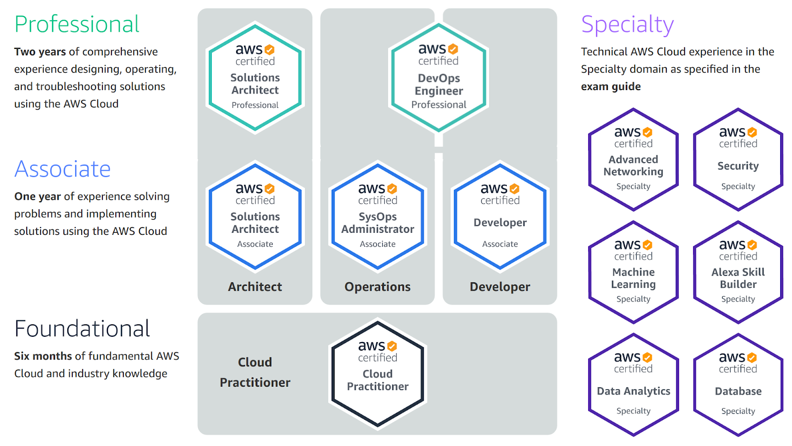
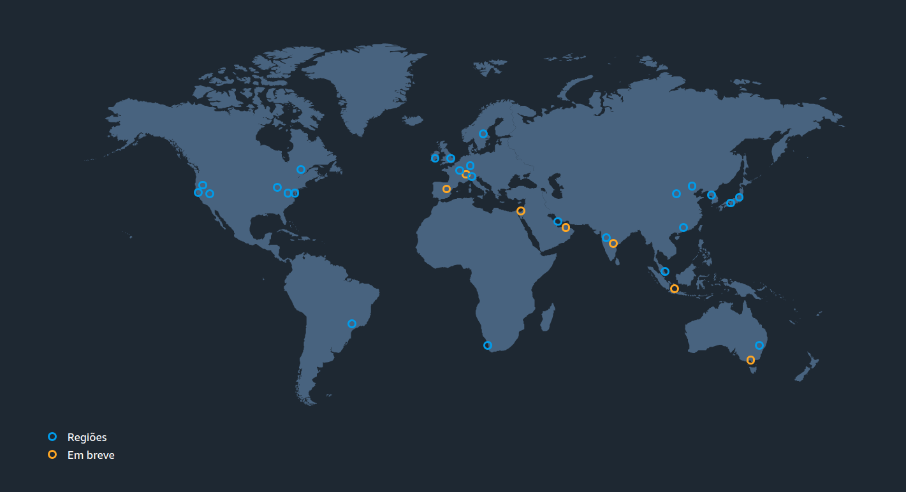
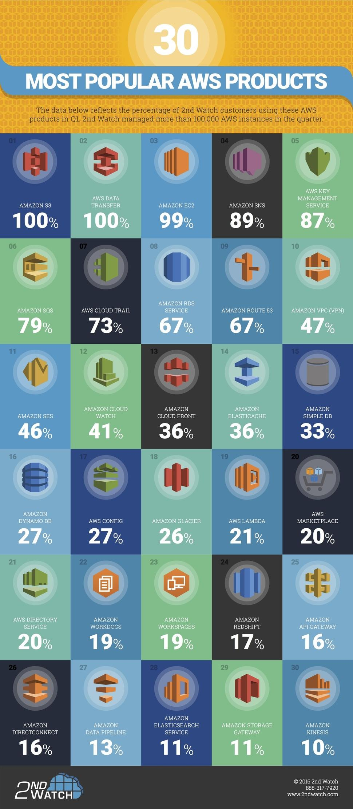
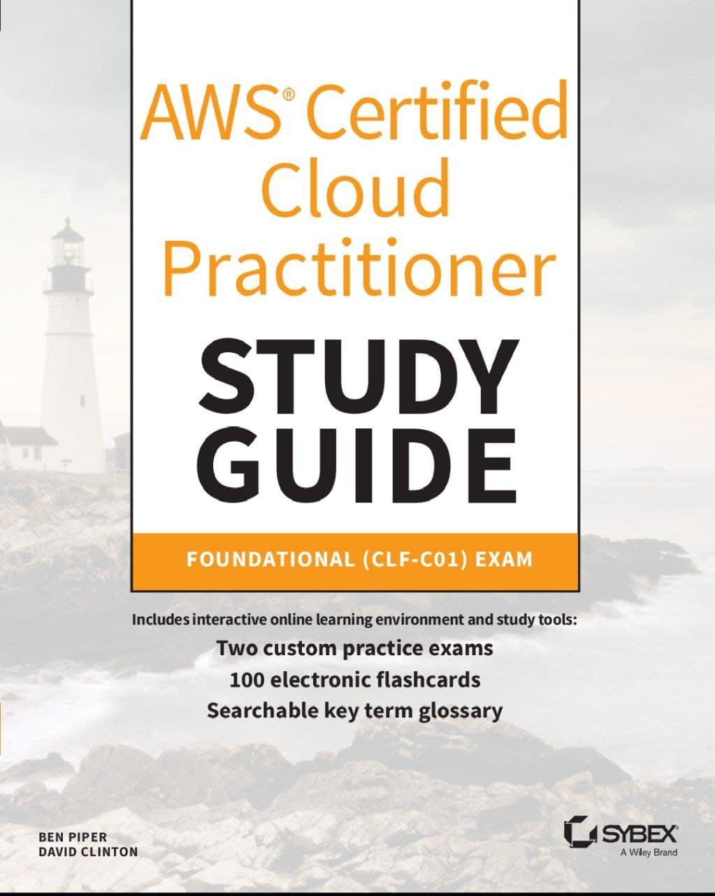
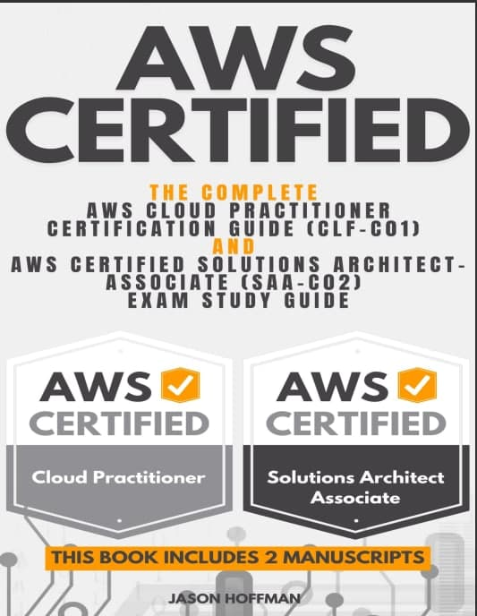
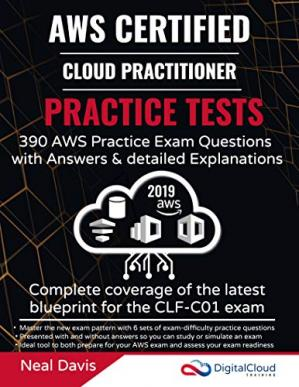
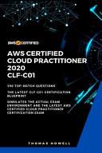
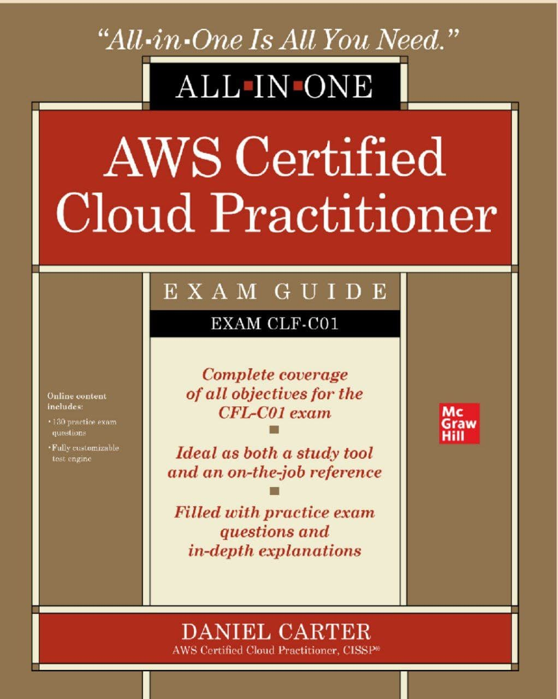
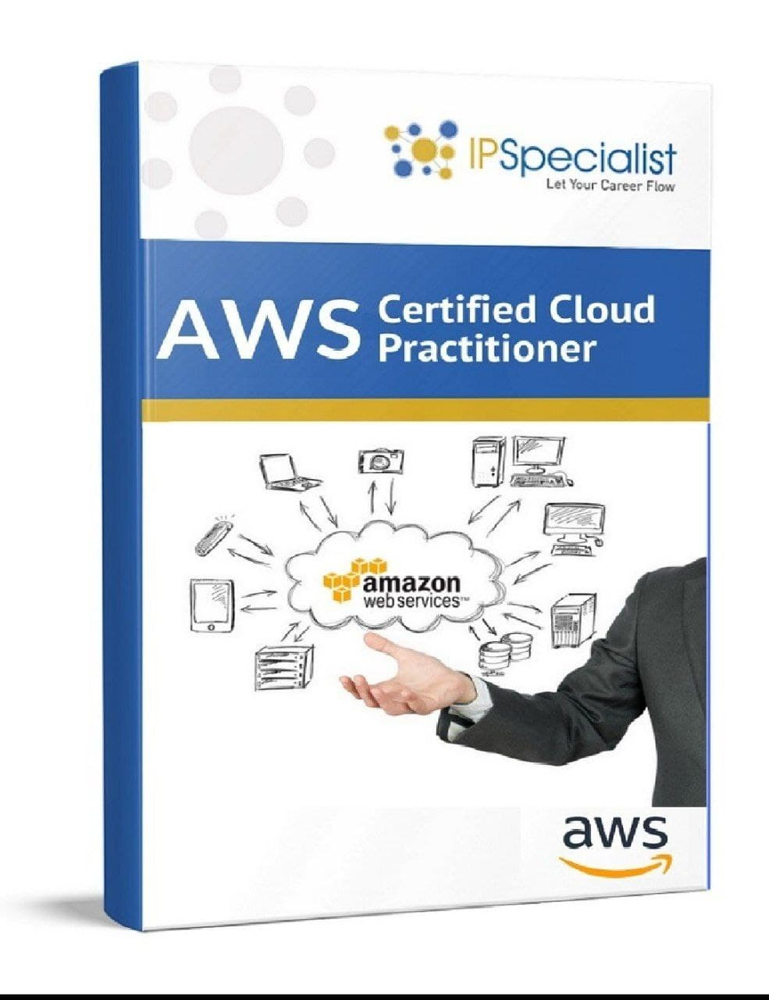

 # This space's mission is to use the 7 best ways to apply <i>ACTIVE</i> learning in AWS Cloud Practitioner Certification studies.
1. Write it all down!
2. Griffe and doodle!
3. Question yourself at the end of a reading or class
4. Search more!
5. Do exercises
6. Create mind maps
7. Teach someone!

# Goal
In addition to the above objective, it is also possible to organize in a single topic several possibilities of studies, for the study
AWS Cloud Practitioner Certification, focusing on others who already report how to get there, and also linking content that
were and can be of great help to new students.

# AWS Cloud Practitioner Exam Guide

The AWS Certified Cloud Practitioner exam **(CLF-C02)** is intended for individuals who have the knowledge and skills required to effectively demonstrate a general understanding of the AWS cloud, independent of specific technical roles covered by other AWS certifications (e.g., solutions - Associate, Developer - Associate or SysOps Administrator - Associate).
This exam allows individuals to validate their AWS cloud knowledge with an industry-recognized credential.

This guide is in the works to help anyone who wants to take the AWS Certified Cloud Practitioner certification, cover it up and share some of my thoughts and ideas for those planning to take the exam.
The AWS Cloud Practitioner certification is a great entry point into the world of Amazon AWS.

Our focus is AWS Cloud Practitioner Certification, which is the gateway to others.

# What is AWS Cloud Practitioner Certification?

 What is AWS Cloud Practitioner Certification? 

Amazon has multiple AWS cloud certification paths.
The AWS Certified Cloud Practitioner certification is an entry-level certification that is intended to demonstrate a basic level of Amazon AWS cloud knowledge and skills.
This exam is suitable for professionals in technical, managerial, and sales roles.

To become certified, you must pass a single exam. Amazon recommends that you have at least <b>6 months of experience</b> before taking the exam. I had no prior experience with Amazon AWS prior to studying for the exam. I, however, seek in all ways to evolve.

The Certified Cloud Practitioner certification page provides links to numerous study resources, including AWS white papers, links to book the exam, sample test questions, and more.

# The content covered in the exam is as follows:

- Domain 1: Cloud Concepts (24% of scored content)
- Domain 2: Security and Compliance (30% of scored content)
- Domain 3: Cloud Technology and Services (34% of scored content)
- Domain 4: Billing, Pricing, and Support (12% of scored content)

# Domain 1: Cloud Concepts
## Task Statement 1.1: Define the benefits of the AWS Cloud.
- Knowledge of:
    - Value proposition of the AWS Cloud
- Skills in:
    - Understanding the economies of scale (for example, cost savings)
    - Understanding the benefits of global infrastructure (for example, speed of deployment, global reach)
    - Understanding the advantages of high availability, elasticity, and agility

## Task Statement 1.2: Identify design principles of the AWS Cloud.
- Knowledge of:
  - AWS Well-Architected Framework

- Skills in:
    - Understanding the pillars of the Well-Architected Framework (for example, operational excellence, security, reliability, performance efficiency, cost optimization, sustainability)
    - Identifying differences between the pillars of the Well-Architected Framework

## Task Statement 1.3: Understand the benefits of and strategies for migration to the AWS Cloud.
- Knowledge of:
    - Cloud adoption strategies
    - Resources to support the cloud migration journey

- Skills in:
    - Understanding the benefits of the AWS Cloud Adoption Framework (AWS CAF) (for example, reduced business risk; improved environmental, social, and governance (ESG) performance; increased revenue; increased operational efficiency)
    - Identifying appropriate migration strategies (for example, database replication, use of AWS Snowball)

## Task Statement 1.4: Understand concepts of cloud economics.
- Knowledge of:
    - Aspects of cloud economics
    - Cost savings of moving to the cloud

- Skills in:
    - Understanding the role of fixed costs compared with variable costs
    - Understanding costs that are associated with on-premises environments
    - Understanding the differences between licensing strategies (for example, Bring Your Own License [BYOL] model compared with included licenses)
    - Understanding the concept of rightsizing
    - Identifying benefits of automation (for example, provisioning and configuration management with AWS CloudFormation)
    - Identifying managed AWS services (for example, Amazon RDS, Amazon Elastic Container Service [Amazon ECS], Amazon Elastic Kubernetes Service [Amazon EKS], Amazon DynamoDB)

# Domain 2: Security and Compliance

## Task Statement 2.1: Understand the AWS shared responsibility model.

- Knowledge of:
    - AWS shared responsibility model

- Skills in:
    - Recognizing the components of the AWS shared responsibility model
    - Describing the customer’s responsibilities on AWS
    - Describing AWS responsibilities
    - Describing responsibilities that the customer and AWS share
    - Describing how AWS responsibilities and customer responsibilities can shift, depending on the service used (for example, Amazon RDS, AWS Lambda, Amazon EC2)

## Task Statement 2.2: Understand AWS Cloud security, governance, and compliance concepts.
- Knowledge of:
    - AWS compliance and governance concepts
    - Benefits of cloud security (for example, encryption)
    - Where to capture and locate logs that are associated with cloud security

- Skills in:
    - Identifying where to find AWS compliance information (for example, AWS Artifact)
    - Understanding compliance needs among geographic locations or industries (for example, AWS Compliance)
    - Describing how customers secure resources on AWS (for example, Amazon Inspector, AWS Security Hub, Amazon GuardDuty, AWS Shield)
    - Identifying different encryption options (for example, encryption in transit, encryption at rest)
    - Recognizing services that aid in governance and compliance (for example, monitoring with Amazon CloudWatch; auditing with AWS CloudTrail, AWS Audit Manager, and AWS Config; reporting with access reports)
    - Recognizing compliance requirements that vary among AWS services

## Task Statement 2.3: Identify AWS access management capabilities.

- Knowledge of:
    - Identity and access management (for example, AWS Identity and Access Management [IAM])
    - Importance of protecting the AWS root user account
    - Principle of least privilege
    - AWS IAM Identity Center (AWS Single Sign-On)

- Skills in:
    - Understanding access keys, password policies, and credential storage (for example, AWS Secrets Manager, AWS Systems Manager)
    - Identifying authentication methods in AWS (for example, multi-factor authentication [MFA], IAM Identity Center, cross-account IAM roles)
    - Defining groups, users, custom policies, and managed policies in compliance with the principle of least privilege
    - Identifying tasks that only the account root user can perform
    - Understanding which methods can achieve root user protection
    - Understanding the types of identity management (for example, federated)

## Task Statement 2.4: Identify components and resources for security.
- Knowledge of:
    - Security capabilities that AWS provides
    - Security-related documentation that AWS provides

- Skills in:
    - Describing AWS security features and services (for example, security groups, network ACLs, AWS WAF)
    - Understanding that third-party security products are available from AWS Marketplace
    - Identifying where AWS security information is available (for example, AWS Knowledge Center, AWS Security Center, AWS Security Blog)
    - Understanding the use of AWS services for identifying security issues (for example, AWS Trusted Advisor)

# Domain 3: Cloud Technology and Services

## Task Statement 3.1: Define methods of deploying and operating in the AWS Cloud.

- Knowledge of:
    - Different ways of provisioning and operating in the AWS Cloud
    - Different ways to access AWS services
    - Types of cloud deployment models
    - Connectivity options

- Skills in:
    - Deciding between options such as programmatic access (for example, APIs, SDKs, CLI), the AWS Management Console, and infrastructure as code (IaC)
    - Evaluating requirements to determine whether to use one-time operations or repeatable processes
    - Identifying different deployment models (for example, cloud, hybrid, onpremises)
    - Identifying connectivity options (for example, AWS VPN, AWS Direct Connect, public internet)

## Task Statement 3.2: Define the AWS global infrastructure.
- Knowledge of:
    - AWS Regions, Availability Zones, and edge locations
    - High availability
    - Use of multiple Regions
    - Benefits of edge locations
    - AWS Wavelength Zones and AWS Local Zones

- Skills in:
    - Describing relationships among Regions, Availability Zones, and edge locations
    - Describing how to achieve high availability by using multiple Availability Zones
    - Recognizing that Availability Zones do not share single points of failure
    - Describing when to use multiple Regions (for example, disaster recovery, business continuity, low latency for end users, data sovereignty)
    - Describing at a high level the benefits of edge locations (for example, Amazon CloudFront, AWS Global Accelerator)

## Task Statement 3.3: Identify AWS compute services.
- Knowledge of:
    - AWS compute services

- Skills in:
    - Recognizing the appropriate use of different EC2 instance types (for example, compute optimized, storage optimized)
    - Recognizing the appropriate use of different container options (for example, Amazon ECS, Amazon EKS)
    - Recognizing the appropriate use of different serverless compute options (for example, AWS Fargate, Lambda)
    - Recognizing that auto scaling provides elasticity
    - Identifying the purposes of load balancers

## Task Statement 3.4: Identify AWS database services.
- Knowledge of:
    - AWS database services
    - Database migration

- Skills in:
    - Deciding when to use EC2 hosted databases or AWS managed databases
    - Identifying relational databases (for example, Amazon RDS, Amazon Aurora)
    - Identifying NoSQL databases (for example, DynamoDB)
    - Identifying memory-based databases
    - Identifying database migration tools (for example AWS Database Migration Service [AWS DMS], AWS Schema Conversion Tool [AWS SCT])

## Task Statement 3.5: Identify AWS network services.
- Knowledge of:
    - AWS network services

- Skills in:
    - Identifying the components of a VPC (for example, subnets, gateways)
    - Understanding security in a VPC (for example, network ACLs, security groups)
    - Understanding the purpose of Amazon Route 53
    - Identifying edge services (for example, CloudFront, Global Accelerator)
    - Identifying network connectivity options to AWS (for example AWS VPN, Direct Connect)

## Task Statement 3.6: Identify AWS storage services.
- Knowledge of:
    - AWS storage services

- Skills in:
    - Identifying the uses for object storage
    - Recognizing the differences in Amazon S3 storage classes
    - Identifying block storage solutions (for example, Amazon Elastic Block Store [Amazon EBS], instance store)
    - Identifying file services (for example, Amazon Elastic File System [Amazon EFS], Amazon FSx)
    - Identifying cached file systems (for example, AWS Storage Gateway)
    - Understanding use cases for lifecycle policies
    - Understanding use cases for AWS Backup

## Task Statement 3.7: Identify AWS artificial intelligence and machine learning (AI/ML) services and analytics services.
- Knowledge of:
    - AWS AI/ML services
    - AWS analytics services

- Skills in:
    - Understanding the different AI/ML services and the tasks that they accomplish (for example, Amazon SageMaker, Amazon Lex, Amazon Kendra)
    - Identifying the services for data analytics (for example, Amazon Athena, Amazon Kinesis, AWS Glue, Amazon QuickSight)

# Task Statement 3.8: Identify services from other in-scope AWS service categories.
- Knowledge of:
    - Application integration services of Amazon EventBridge, Amazon Simple Notification Service (Amazon SNS), and Amazon Simple Queue Service (Amazon SQS)
    - Business application services of Amazon Connect and Amazon Simple Email Service (Amazon SES)
    - Customer engagement services of AWS Activate for Startups, AWS IQ, AWS Managed Services (AMS), and AWS Support
    - Developer tool services and capabilities of AWS AppConfig, AWS Cloud9, AWS CloudShell, AWS CodeArtifact, AWS CodeBuild, AWS CodeCommit, AWS CodeDeploy, AWS CodePipeline, AWS CodeStar, and AWS X-Ray
    - End-user computing services of Amazon AppStream 2.0, Amazon WorkSpaces, and Amazon WorkSpaces Web
    - Frontend web and mobile services of AWS Amplify and AWS AppSync
    - IoT services of AWS IoT Core and AWS IoT Greengrass

- Skills in:
    - Choosing the appropriate service to deliver messages and to send alerts and notifications
    - Choosing the appropriate service to meet business application needs
    - Choosing the appropriate service for AWS customer support
    - Choosing the appropriate option for business support assistance
    - Identifying the tools to develop, deploy, and troubleshoot applications
    - Identifying the services that can present the output of virtual machines (VMs) on end-user machines
    - Identifying the services that can create and deploy frontend and mobile services
    - Identifying the services that manage IoT devices

# Domain 4: Billing, Pricing, and Support

## Task Statement 4.1: Compare AWS pricing models.
- Knowledge of:
    - Compute purchasing options (for example, On-Demand Instances, Reserved Instances, Spot Instances, Savings Plans, Dedicated Hosts, Dedicated Instances, Capacity Reservations)
    - Data transfer charges
    - Storage options and tiers

- Skills in:
    - Identifying and comparing when to use various compute purchasing options
    - Describing Reserved Instance flexibility
    - Describing Reserved Instance behavior in AWS Organizations
    - Understanding incoming data transfer costs and outgoing data transfer costs (for example, from one Region to another Region, within the same Region)
    - Understanding different pricing options for various storage options and tiers

## Task Statement 4.2: Understand resources for billing, budget, and cost management.
- Knowledge of:
    - Billing support and information
    - Pricing information for AWS services
    - AWS Organizations
    - AWS cost allocation tags

- Skills in:
    - Understanding the appropriate uses and capabilities of AWS Budgets, AWS Cost Explorer, and AWS Billing Conductor
    - Understanding the appropriate uses and capabilities of AWS Pricing Calculator
    - Understanding AWS Organizations consolidated billing and allocation of costs
    - Understanding various types of cost allocation tags and their relation to billing reports (for example, AWS Cost and Usage Report)

## Task Statement 4.3: Identify AWS technical resources and AWS Support options.
- Knowledge of:
    - Resources and documentation available on official AWS websites
    - AWS Support plans
    - Role of the AWS Partner Network, including independent software vendors and system integrators
    - AWS Support Center

- Skills in:
    - Locating AWS whitepapers, blogs, and documentation on official AWS websites
    - Identifying and locating AWS technical resources (for example AWS Prescriptive Guidance, AWS Knowledge Center, AWS re:Post)
    - Identifying AWS Support options for AWS customers (for example, customer service and communities, AWS Developer Support, AWS Business Support, AWS Enterprise On-Ramp Support, AWS Enterprise Support)
    - Identifying the role of Trusted Advisor, AWS Health Dashboard, and the AWS Health API to help manage and monitor environments for cost optimization
    - Identifying the role of the AWS Trust and Safety team to report abuse of AWS resources
    - Understanding the role of AWS Partners (for example AWS Marketplace, independent software vendors, system integrators)
    - Identifying the benefits of being an AWS Partner (for example, partner training and certification, partner events, partner volume discounts)
    - Identifying the key services that AWS Marketplace offers (for example, cost management, governance and entitlement)
    - Identifying technical assistance options available at AWS (for example, AWS Professional Services, AWS Solutions Architects)

----------------------------------------------------------------------------------------------------------------------

## The AWS Certified Cloud Practitioner exam (CLF-C02) 

The AWS Certified Cloud Practitioner exam (CLF-C02) is intended for individuals who have the knowledge and skills necessary to effectively
demonstrate a general understanding of the AWS cloud, independent of specific technical roles covered by other AWS certifications (eg, Solutions Architect - Associate, Developer - Associate, or SysOps Administrator - Associate).
This exam allows individuals to validate their AWS cloud knowledge with an industry-recognized credential.

# Exam details
Prices: $100

Exam duration: 90 minutes

Exam content:
Two types of questions on the exam
Multiple choice: has one correct answer and three incorrect answers (distractors).
Multiple answer: has two correct answers from five options.

Always choose the best answer(s). incorrect answers
will be plausible and are designed to be attractive to candidates who don't know the correct answer.

Unanswered questions are scored as incorrect. There is no penalty for guessing.

Exam results:
The AWS Certified Cloud Practitioner exam (CLF-C02) is a pass or fail exam. The exam is scored against a minimum standard
established by AWS professionals who are guided by certification industry best practices and guidelines.
Exam results are reported as a scaled score from 100 to 1000, with a minimum passing score of 700.
The score shows how well you performed on the exam as a whole and whether or not you passed.
Validity of the exam: 2 years; Recertification is required every 2 years for all AWS Certifications.

# Exam preparation guide
Exam preparation can be accomplished through self-study with textbooks, practice exams, and on-site classroom programs. This book provides you with all the information and knowledge to help you pass the AWS Certified Cloud Practitioner Exam.
IPSpecialist provides full support for candidates to pass the exam.

<b>Step 1:</b> Consultar o Guia do Exame na AWS 
[https://aws.amazon.com/certification/certified-cloud-practitioner/?nc1=h_ls](https://aws.amazon.com/certification/certified-cloud-practitioner/?nc1=h_ls)

Guia do Exame

[AWS-Certified-Cloud-Practitioner_Exam-Guide](https://d1.awsstatic.com/training-and-certification/docs-cloud-practitioner/AWS-Certified-Cloud-Practitioner_Exam-Guide.pdf)

<b>Step 2:</b> Take the AWS Training Class
These courses and training materials will help you prepare for the exam:
AWS Training <a href="https://aws.amazon.com/en/training/">(aws.amazon.com/training)</a>

And in the above link get the study materials
<a href="https://d1.awsstatic.com/training-and-certification/ramp-up_guides/Ramp-Up_Guide_CloudPractitioner.pdf"> Pdf with the information</a>

The above file has important information like LEARNING RESOURCE, DURATION and TYPE, which gives you a path to follow, what ahead will be highlighted each theme and how each question is formed.

<b>Step 3:</b> Review the exam guide and sample questions
Review the exam template and study the sample questions available on the AWS website

<b>Step 4:</b> practice with individualized labs and study officer Documentations

Sign up for AWS Free Tier accounts to use limited free services and
Practice labs. Also, you can study the official documentation on the website.

<b>Step 5:</b> study the AWS whitepapers

1. Expand your technical knowledge with white papers written by the AWS team.
2. AWS Whitepapers (aws.amazon.com/whitepapers) Kindle, .pdf and other Materials
3. Amazon Web Services White Paper Overview, April 2017
4. Architecting for the Cloud: AWS Best Practices Whitepaper, February 2016
5. White Paper How AWS Pricing Works, March 2016
6. The Total Cost of (Not) Ownership of Web Applications in the Cloud White Paper, August 2012
7. AWS Support Plans Comparison Page

<b>Step 6:</b> Review the AWS FAQ
Browse these FAQs to find answers to the most common questions.

<b>Step 6:</b> take a mock exam
Test your knowledge online in a timed environment by registering at aws.training.

<b>Step 7:</b> schedule your exam and get certified
Schedule your exam at a testing center near you at aws.training.

## Which key tools, technologies, and concepts might be covered on the exam?

The following is a non-exhaustive list of the tools and technologies that could appear on the exam. This list is subject to change and is provided to help you understand the general scope of services, features, or technologies on the exam. The general tools and technologies in this list appear in no particular order.

AWS services are grouped according to their primary functions. While some of these technologies will likely be covered more than others on the exam, the order and placement of them in this list are no indication of relative weight or importance:

- [APIs](https://github.com/weder96/aws-certification-learning/tree/main/module-12#section-6)
- Benefits of migrating to the AWS Cloud
- AWS Cloud Adoption Framework (AWS CAF)
- AWS Compliance
- Compute
- Cost management
- Databases
- Amazon EC2 instance types (for example, Reserved, On-Demand, Spot)
- AWS global infrastructure (for example, AWS Regions, Availability Zones)
- Infrastructure as code (IaC)
- AWS Knowledge Center
- Machine learning
- Management and governance
- Migration and data transfer
- Network services
- AWS Partner Network
- AWS Prescriptive Guidance
- AWS Pricing Calculator
- AWS Professional Services
- AWS re:Post
- AWS SDKs
- Security
- AWS Security Blog
- AWS Security Center
- AWS shared responsibility model
- AWS Solutions Architects
- Storage

## AWS services and features

### **Analytics:**
- [Amazon Athena](https://github.com/weder96/aws-certification-learning/tree/main/module-11#section-02)
- [AWS Data Exchange](https://github.com/weder96/aws-certification-learning/tree/main/module-11#section-11)
- [Amazon EMR](https://github.com/weder96/aws-certification-learning/tree/main/module-11#section-01)
- [AWS Glue](https://github.com/weder96/aws-certification-learning/tree/main/module-11#section-03)
- [Amazon Kinesis](https://github.com/weder96/aws-certification-learning/tree/main/module-11#section-05)
- [Amazon Managed Streaming for Apache Kafka (Amazon MSK)](https://github.com/weder96/aws-certification-learning/tree/main/module-11#section-17)
- [Amazon OpenSearch Service](https://github.com/weder96/aws-certification-learning/tree/main/module-11#section-10)
- [Amazon QuickSight](https://github.com/weder96/aws-certification-learning/tree/main/module-11#section-15)
- [Amazon Redshift](https://github.com/weder96/aws-certification-learning/tree/main/module-11#section-16)

----------------------------------------------------------------------------------------------------------------------------
### **Application Integration:**
-  [Amazon EventBridge](https://github.com/weder96/aws-certification-learning/tree/main/module-12#section-7)
-  [Amazon Simple Notification Service (Amazon SNS)](https://github.com/weder96/aws-certification-learning/tree/main/module-12#section-1)
- [Amazon Simple Queue Service (Amazon SQS)](https://github.com/weder96/aws-certification-learning/tree/main/module-12#section-2)
-  [AWS Step Functions](https://github.com/weder96/aws-certification-learning/tree/main/module-12#section-8)

----------------------------------------------------------------------------------------------------------------------------

### **Business Applications:**

-  [Amazon Connect](https://github.com/weder96/aws-certification-learning/tree/main/module-27#section_02)
-  [Amazon Simple Email Service (Amazon SES)](https://aws.amazon.com/ses/?nc1=h_ls)

----------------------------------------------------------------------------------------------------------------------------

### **Cloud Financial Management:**
- AWS Billing Conductor
- AWS Budgets
- AWS Cost and Usage Report
- AWS Cost Explorer
- AWS Marketplace

----------------------------------------------------------------------------------------------------------------------------
### **Compute and Serverless:**
-  [AWS Batch](https://github.com/weder96/aws-certification-learning/tree/main/module-6#section-9)
-  [Amazon EC2](https://github.com/weder96/aws-certification-learning/tree/main/module-6#section-1)
-  [AWS Elastic Beanstalk](https://github.com/weder96/aws-certification-learning/tree/main/module-6#section-8)
-  [Amazon Lightsail](https://github.com/weder96/aws-certification-learning/tree/main/module-6#section-6)
- AWS Local Zones
- AWS Outposts
- AWS Wavelength

-  [Amazon WorkSpaces](https://github.com/weder96/aws-certification-learning/tree/main/module-6#section-14)

----------------------------------------------------------------------------------------------------------------------------
### **Containers:**
-  [Amazon Elastic Container Registry (Amazon ECR)](https://github.com/weder96/aws-certification-learning/tree/main/module-18#section-01)
-  [Amazon Elastic Container Service (Amazon ECS)](https://github.com/weder96/aws-certification-learning/tree/main/module-18#section-02)
-  [Amazon Elastic Kubernetes Service (Amazon EKS)](https://github.com/weder96/aws-certification-learning/tree/main/module-18#section-03)

----------------------------------------------------------------------------------------------------------------------------
### **Customer Engagement:**
- AWS Activate for Startups
- AWS IQ
- AWS Managed Services (AMS)
- AWS Support

----------------------------------------------------------------------------------------------------------------------------
### **Database:**
-  [Amazon Aurora](https://github.com/weder96/aws-certification-learning/tree/main/module-8#section-12)
-  [Amazon DynamoDB](https://github.com/weder96/aws-certification-learning/tree/main/module-8#section-03)
-  [Amazon MemoryDB for Redis](https://aws.amazon.com/memorydb/?nc1=h_ls)
-  [Amazon Neptune](https://github.com/weder96/aws-certification-learning/tree/main/module-8#section-11)
-  [Amazon RDS](https://github.com/weder96/aws-certification-learning/tree/main/module-8#section-02)

----------------------------------------------------------------------------------------------------------------------------
### **Developer Tools:**
-  [AWS AppConfig](https://docs.aws.amazon.com/appconfig/latest/userguide/what-is-appconfig.html)  
-  [AWS CLI](https://github.com/weder96/aws-certification-learning/tree/main/module-26#section_13) 
-  [AWS Cloud9](https://github.com/weder96/aws-certification-learning/tree/main/module-26#section_02) 
-  [AWS CloudShell](https://github.com/weder96/aws-certification-learning/tree/main/module-26#section_05)
-  [AWS CodeArtifact](https://github.com/weder96/aws-certification-learning/tree/main/module-26#section_09)
-  [AWS CodeBuild](https://github.com/weder96/aws-certification-learning/tree/main/module-26#section_04)
-  [AWS CodeCommit](https://github.com/weder96/aws-certification-learning/tree/main/module-26#section_06)
-  [AWS CodeDeploy](https://github.com/weder96/aws-certification-learning/tree/main/module-26#section_07)
-  [AWS CodePipeline](https://github.com/weder96/aws-certification-learning/tree/main/module-26#section_10)
-  [AWS CodeStar](https://github.com/weder96/aws-certification-learning/tree/main/module-26#section_03)
-  [AWS X-Ray](https://github.com/weder96/aws-certification-learning/tree/main/module-26#section_01)

----------------------------------------------------------------------------------------------------------------------------
### **End User Computing: *- 
- Amazon AppStream 2.0 
- Amazon WorkSpaces 
- Amazon WorkSpaces Web

----------------------------------------------------------------------------------------------------------------------------
### **Frontend Web and Mobile: *- 
- AWS Amplify 
- AWS AppSync 
- AWS Device Farm

----------------------------------------------------------------------------------------------------------------------------
### **Internet of Things (IoT): *- 
- AWS IoT Core 
- AWS IoT Greengrass

----------------------------------------------------------------------------------------------------------------------------
### **Machine Learning:** 
-  [Amazon Comprehend](https://github.com/weder96/aws-certification-learning/tree/main/module-19#section-01) 
-  [Amazon Kendra](https://github.com/weder96/aws-certification-learning/tree/main/module-19#section-04)
-  [Amazon Lex](https://github.com/weder96/aws-certification-learning/tree/main/module-19#section-05) 
-  [Amazon Polly](https://github.com/weder96/aws-certification-learning/tree/main/module-19#section-06) 
-  [Amazon Rekognition](https://github.com/weder96/aws-certification-learning/tree/main/module-19#section-07) 
-  [Amazon SageMaker](https://github.com/weder96/aws-certification-learning/tree/main/module-19#section-08)
-  [Amazon Textract](https://github.com/weder96/aws-certification-learning/tree/main/module-19#section-09)
-  [Amazon Transcribe](https://github.com/weder96/aws-certification-learning/tree/main/module-19#section-10)
-  [Amazon Translate](https://github.com/weder96/aws-certification-learning/tree/main/module-19#section-11)

----------------------------------------------------------------------------------------------------------------------------
### **Management and Governance:**
-  [AWS Auto Scaling](https://github.com/weder96/aws-certification-learning/tree/main/module-10#section-1)
-  [AWS CloudFormation](https://github.com/weder96/aws-certification-learning/tree/main/module-20#section-2)
-  [AWS CloudTrail](https://github.com/weder96/aws-certification-learning/tree/main/module-20#section-3)
-  [Amazon CloudWatch](https://github.com/weder96/aws-certification-learning/tree/main/module-20#section-4)
- AWS Compute Optimizer
-  [AWS Config](https://github.com/weder96/aws-certification-learning/tree/main/module-20#section-7)
- AWS Control Tower
- AWS Health Dashboard
- AWS Launch Wizard
- AWS Management Console
-  [AWS Organizations](https://github.com/weder96/aws-certification-learning/tree/main/module-15#section-18)
- AWS Resource Groups and Tag Editor
- AWS Service Catalog
- AWS Systems Manager
- AWS Trusted Advisor
-  [AWS Trusted Advisor](https://github.com/weder96/aws-certification-learning/tree/main/module-20#section-18)
- AWS Well-Architected Tool

----------------------------------------------------------------------------------------------------------------------------
### **Migration and Transfer:**
- AWS Application Discovery Service
- AWS Application Migration Service
- AWS Database Migration Service (AWS DMS)
- AWS Migration Hub
- AWS Schema Conversion Tool (AWS SCT)
- AWS Snow Family
- AWS Transfer Family

----------------------------------------------------------------------------------------------------------------------------
### **Networking and Content Delivery:**
-  [Amazon API Gateway](https://github.com/weder96/aws-certification-learning/tree/main/module-5#section-10)
-  [Amazon CloudFront](https://github.com/weder96/aws-certification-learning/tree/main/module-5#section-1)
-  [AWS Direct Connect](https://github.com/weder96/aws-certification-learning/tree/main/module-5#section-2)
- AWS Global Accelerator
-  [Amazon Route 53](https://github.com/weder96/aws-certification-learning/tree/main/module-5#section-6)
-  [Amazon VPC](https://github.com/weder96/aws-certification-learning/tree/main/module-5#section-8)
- AWS VPN

----------------------------------------------------------------------------------------------------------------------------
### **Security, Identity, and Compliance:**
-  [AWS Artifact](https://github.com/weder96/aws-certification-learning/tree/main/module-4#section-02)
- AWS Audit Manager
-  [AWS Certificate Manager (ACM)](https://github.com/weder96/aws-certification-learning/tree/main/module-4#section-07)
-  [AWS CloudHSM](https://github.com/weder96/aws-certification-learning/tree/main/module-4#section-06)
-  [Amazon Cognito](https://github.com/weder96/aws-certification-learning/tree/main/module-4#section-11)
-  [Amazon Detective](https://github.com/weder96/aws-certification-learning/tree/main/module-4#section-17)
- AWS Directory Service
- AWS Firewall Manager
-  [Amazon GuardDuty](https://github.com/weder96/aws-certification-learning/tree/main/module-4#section-03)
- AWS IAM Identity Center (AWS Single Sign-On)
-  [AWS Identity and Access Management (IAM)](https://github.com/weder96/aws-certification-learning/tree/main/module-15)
-  [Amazon Inspector](https://github.com/weder96/aws-certification-learning/tree/main/module-4#section-01)
- AWS Key Management Service (AWS KMS)
-  [Amazon Macie](https://github.com/weder96/aws-certification-learning/tree/main/module-4#section-19)
- AWS Network Firewall
- AWS Resource Access Manager (AWS RAM)
- AWS Secrets Manager
- AWS Security Hub
-  [AWS Shield](https://github.com/weder96/aws-certification-learning/tree/main/module-4#section-23)
-  [AWS WAF](https://github.com/weder96/aws-certification-learning/tree/main/module-4#section-04)

----------------------------------------------------------------------------------------------------------------------------
### **Serverless:**
-  [AWS Lambda](https://github.com/weder96/aws-certification-learning/tree/main/module-14#section-1)
-  [AWS Fargate](https://github.com/weder96/aws-certification-learning/tree/main/module-18#section-04)

----------------------------------------------------------------------------------------------------------------------------
### **Storage:**
-  [AWS Backup](https://github.com/weder96/aws-certification-learning/tree/main/module-7#section-7)
-  [Amazon Elastic Block Store (Amazon EBS)](https://github.com/weder96/aws-certification-learning/tree/main/module-7#section-3)
-  [Amazon Elastic File System (Amazon EFS)](https://github.com/weder96/aws-certification-learning/tree/main/module-7#section-5)
- AWS Elastic Disaster Recovery
-  [Amazon FSx](https://github.com/weder96/aws-certification-learning/tree/main/module-7#section-7)
-  [Amazon S3](https://github.com/weder96/aws-certification-learning/tree/main/module-7#section-1)
-  [Amazon S3 Glacier](https://github.com/weder96/aws-certification-learning/tree/main/module-7#section-1)
-  [AWS Storage Gateway](https://github.com/weder96/aws-certification-learning/tree/main/module-7#section-6)

----------------------------------------------------------------------------------------------------------------------------
# The AWS services

AWS services allow access to computing resources, storage, databases and various other on-demand IT services. According to Amazon, this form of computing reduces costs, minimizes the risk of failure and maximizes business opportunities.

The AWS portal for Brazil is <a href="https://aws.amazon.com/pt/" alt="PT" > (https://aws.amazon.com/pt/) </a> .

It is possible to try out the main services, completely free of charge, for a period of one year. More information about this free trial is found on this page: <a href="https://aws.amazon.com/en/free/" alt="https://aws.amazon.com/en/free/"> https://aws.amazon.com/pt/free/ </a>.

The AWS Cloud is present in 190 countries across 13 geographic regions, 35 Availability Zones, and over 50 local points of presence. Figure 05 shows this global scope, and it is possible to observe where Amazon's Data Centers are located.

Figure XX - AWS Cloud on-premises coverage and points of presence.  

Source: Amazon website. Available at: <https://aws.amazon.com/pt/what-is-aws>. Accessed on: Aug. from 2021.

AWS customers are companies such as Netflix, Dropbox, Airbnb and Spotify. They all turned into computing giants using the services provided by Amazon's Data Centers.

AWS has a very vast set of products and services from different categories (processing, network, development, database, etc.), as we can see in the Figure Below.

Figure XX - Amazon Web Services products and services.  

Source: Amazon Services. Available at: <http://images.slideplayer.com/26/8773584/slides/slide_2.jpg>. Accessed on: Aug. from 2021.

# In a Computer World article highlights the 30 most sought after services on AWS

Source: Amazon Services. Available at: <https://www.computerworld.com.pt/2016/06/17/30-servicos-mais-procurados-na-aws/>. Accessed on: Aug. from 2021.

# Some techniques that help in the improvement of Learning:

According to <b>Beatriz Oliveira</b> in her title article:

# How I Prepared for the AWS Certified Cloud Practitioner Certification
Available at: <a href="https://medium.com/sysadminas/como-me-preparei-para-a-certifica%C3%A7%C3%A3o-aws-cloud-pratictioner-358d37fb9c60" alt="Article Beatriz Oliveira"> (https://medium.com/sysadminas/como-me-preparei-para-a-certifica%C3%A7%C3%A3o-aws-cloud-pratictioner-358d37fb9c60) </a>

In this article, she reports tips for those who want to get this certification, which I am currently following:

If you already have some experience with AWS, dedicate at least 1 hour a day for about 3 months to study, I believe this is a nice period to study calmly for the test. Amazon recommends this certification for those who have at least 6 months of experience, so I believe that following this recommendation to prepare is very interesting.

Follow the preparation guide available on the AWS website.
<a href="https://d1.awsstatic.com/training-and-certification/docs-cloud-practitioner/AWS-Certified-Cloud-Practitioner_Exam-Guide.pdf"> Preparation Guide </a>

Take free simulations, like the one available on the whizlabs website.
<a href="https://www.whizlabs.com/aws-certified-cloud-practitioner/">https://www.whizlabs.com/aws-certified-cloud-practitioner/</a>

If you can, take the practice exam available on the AWS website
<a href="https://aws.amazon.com/en/certification/certification-prep/"> https://aws.amazon.com/en/certification/certification-prep/ </a>.

Create an account on the AWS website to familiarize yourself with the interface and services while studying.

# Other means I'm using too:
1. Creating Mind Maps.  
2. Specific Books (Subject) and Questions.  
3. Creation of a database of questions about the specific Certification.  
4. Project-Based Learning 
5. Problem-Based Learning 
6. Search youtube classes on the subject.  

#1. Creating Mind Maps.

The mindmaps for AWS services to get AWS Certificates easier. For Vietnamese, you can see the study guide [here](http://notcuder.com/toi-da-lay-chung-chi-aws-solutions-architect-associate-nhu-the-nao/)

Those images are designed with [xmind tool](http://www.xmind.net)

# 2. Specific Books (Subject) and Questions.

     
     
     
     
     
     

# 3. Creation of a database of questions about the specific Certification.

<a href="https://www.awslagi.com/practice-questions/" alt="practice-questions">practice-questions</a> 
Accessed on: Aug. of 2021. 
It has several questions for training, in the case of AWS Cloud Practitioner, the site has 3 Quiz and 6 Pdfs, with the questions.

# 6. Look for classes on youtube on the subject.

Channels on youtube About the Subject:
  
1. Cabeça na Nuvem Project 
www.cabecananuvem.com 
Introduction to cloud computing concepts and content for AWS Cloud Practitioner certification. 
Cristiano Pelizzari 
linkedin: <a href="https://www.linkedin.com/company/cabe%C3%A7a-na-nuvem/" alt="">https://www.linkedin.com/company/cabe%C3 %A7a-in-the-cloud/</a>

<a href="https://www.youtube.com/watch?v=68pF-rrJyqQ&list=PLMpVQWIR2lKesl8rRdVg4qbQcP64xGI2z" alt=""> PlayList with 86 videos:</a>
 
Accessed on: Aug. of 2021. 

What makes this playlist complete is the question of showing the use of AWS in practice, in addition to having a very specific theoretical part.
and directed, another advantage is that it is in Portuguese. 

2. Freecodecamp
<a href="https://www.youtube.com/watch?v=3hLmDS179YE&t=896s" alt=""> AWS Certified Cloud Practitioner Training 2020 - Full Course</a>
 
Accessed on: Aug. of 2021.  

Video description: 
This course will help you become an AWS Certified Cloud Practitioner. You will gain a thorough understanding of the AWS Cloud platform and be prepared to take the certification exam. 
This knowledge and certification will open up job opportunities. You will be able to prove your expertise in AWS and cloud computing. 
The exam can be taken anywhere as an online proctored exam. 
Another cool detail of this video is the comments, where many credit approval for having studied with this format. 

3. IT & Software

[AWS Certified Cloud Practitioner Training Bootcamp](https://www.youtube.com/watch?v=NhDYbskXRgc)</a>
Accessed on: November. of 2024.  

AWS Certified Cloud Practitioner Certification Course (CLF-C02) - Pass the Exam!
Latest Exam Version - PREPARE and PASS the AWS Certified Cloud Practitioner (CLF-C02) Exam

# Calculator

https://calculator.aws/#/

# Labs
https://amazon.qwiklabs.com/

